# Cloud Computing Fundamentals Summary

## Overview

This course covers the fundamentals of cloud computing, from basic concepts and deployment models to detailed implementation of IaaS and PaaS. It explores virtualization, containerization, storage architectures, and security challenges across different cloud service models.

---

## Chapter 1: Introduction to Cloud Computing

### Pre-Cloud Computing Paradigms

Before cloud computing emerged, several computing models laid the foundation:

**Grid Computing**

- Loosely coupled distributed systems
- Job management across heterogeneous resources
- Focuses on coordinating shared resources across organizations
- Example: Scientific computing networks sharing computational power

**Cluster Computing**

- Tightly coupled system creating single system image
- High-performance computing from interconnected nodes
- Homogeneous hardware typically in same location
- Better performance than grids but less flexible

**Utility Computing**

- Service provisioning based on consumption (pay-per-use)
- Resources metered like electricity or water
- Direct precursor to cloud's billing model
- Limited by single-provider infrastructure

**Why Cloud is Unique**: Combines utility's pay-per-use model with grid's distribution and cluster's performance, adding virtualization, multi-tenancy, and global scale.

### Core Definition

- **Cloud Computing**: Delivery of computing services (servers, storage, databases, networking, software) over the Internet with on-demand access, scalability, and pay-per-usage pricing
- Resources are shared, metered, and users pay only for what they consume

### Key Characteristics

| Characteristic | Description |
| --- | --- |
| **On-Demand** | Resources available instantly when needed |
| **Scalability** | Can handle growing workloads by adding resources |
| **Elasticity** | Dynamically adjusts resources in response to changing demands |
| **Resource Pooling** | Shared infrastructure across multiple users (multi-tenancy) |
| **Metered Service** | Usage tracked and billed accordingly |
| **Location Independence** | Data appears to be stored in location-independent manner |

### Amdahl's Law: Theoretical Limits of Parallelization

Amdahl's Law defines the theoretical upper bound of speedup achievable through parallel computing.

**Formula**

$$S(N) = \frac{T(1)}{T(N)}$$

Where:

- $S(N)$ = Speedup with N processors
- $T(1)$ = Execution time with 1 processor
- $T(N)$ = Execution time with N processors

**Key Insight: The Sequential Bottleneck**

$$S \approx \frac{1}{\alpha}$$

Where $\alpha$ = fraction of program that **cannot** be parallelized

**Implications**

- If 5% of code is sequential ($\alpha = 0.05$), max speedup ≈ 20× (regardless of processors)
- Adding more processors has diminishing returns
- Explains why infinite horizontal scaling isn't possible
- Critical for cloud auto-scaling decisions

**Example**: If 10% of your application is sequential, even with 1000 processors, maximum speedup is only 10×.

### Deployment Models

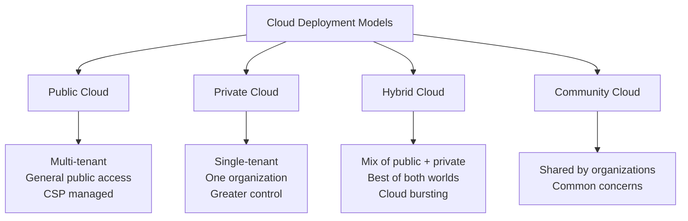

**Public Cloud**

- Multi-tenant environment shared by many customers
- Managed by cloud service providers (CSPs)
- Cost-effective, rapid scalability
- Examples: AWS, Azure, Google Cloud

**Private Cloud**

- Dedicated to single organization
- Can be on-premises or hosted
- Greater security and customization control

**Hybrid Cloud**

- Combines public + private + on-premises infrastructure
- Supports cloud bursting (handling traffic spikes)
- Enables microservices and container orchestration

### Service Models (XaaS)

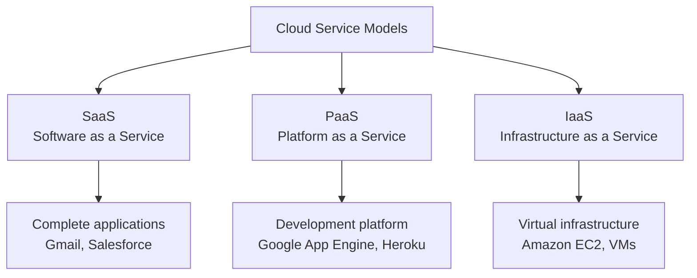

| Service Model | User Manages | Provider Manages | Examples |
|---|---|---|---|
| **IaaS** | OS, applications, data, runtime | Hardware, virtualization, storage, networking | AWS EC2, Azure VMs |
| **PaaS** | Applications, data | Runtime, OS, middleware, infrastructure | Google App Engine, Heroku |
| **SaaS** | Nothing (just use the app) | Everything | Gmail, Salesforce, Office 365 |

<!-- illustration: pyramid diagram showing IaaS at bottom (most control), PaaS middle, SaaS top (least control) -->

### Advantages vs Challenges

| Advantages | Challenges |
|---|---|
| ✓ No upfront infrastructure costs | ✗ Service availability risks |
| ✓ Pay-as-you-go pricing | ✗ Data confidentiality concerns |
| ✓ Elasticity for peak demands | ✗ Vendor lock-in (limited mobility) |
| ✓ Resource sharing efficiency | ✗ Network-dependent (bandwidth bottleneck) |
| ✓ Enables global collaboration | ✗ Performance unpredictability |
| ✓ Reduced maintenance burden | ✗ Security and privacy issues |

### SLA Basics

- **Service Level Agreement**: Contract defining expected service quality, metrics, and responsibilities
- **Key components**: Uptime guarantees (e.g., 99.95%), response time, penalties for violations, accountability
- **Lifecycle**: Discover provider → Define SLA → Establish agreement → Monitor violations → Enforce penalties

### The Future of Cloud: Intelligent Edge + Intelligent Cloud

**Intelligent Edge**

- Connected systems that analyze data **close to the user**
- Reduces latency by processing at network edge instead of centralized data centers
- Examples: IoT devices, smart sensors, edge computing nodes
- Benefits: Real-time processing, reduced bandwidth, better privacy

**Intelligent Cloud**

- Ubiquitous computing enabled by AI and machine learning
- Cloud services that leverage AI for analytics, predictions, automation
- Centralized intelligence accessible from anywhere

**Combined Vision**

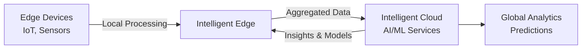

This hybrid approach enables real-time edge decisions while maintaining cloud-scale intelligence and learning.

---

## Chapter 2: Infrastructure as a Service (IaaS)

### Virtualization Fundamentals

- **Virtualization**: Creating virtual versions of hardware/software resources
- Allows multiple OS and applications to run on same physical hardware
- **Key benefit**: Higher utilization, lower costs, energy efficiency

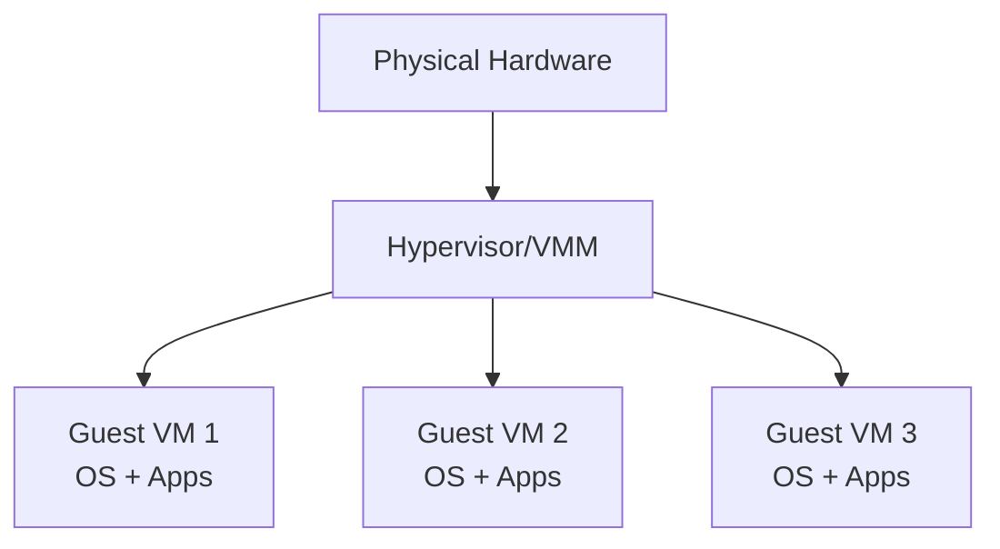

### CPU Virtualization Mechanics: Trap and Emulate

**How Virtual Machines Execute Code**

The fundamental mechanism enabling virtualization is **Trap and Emulate**:

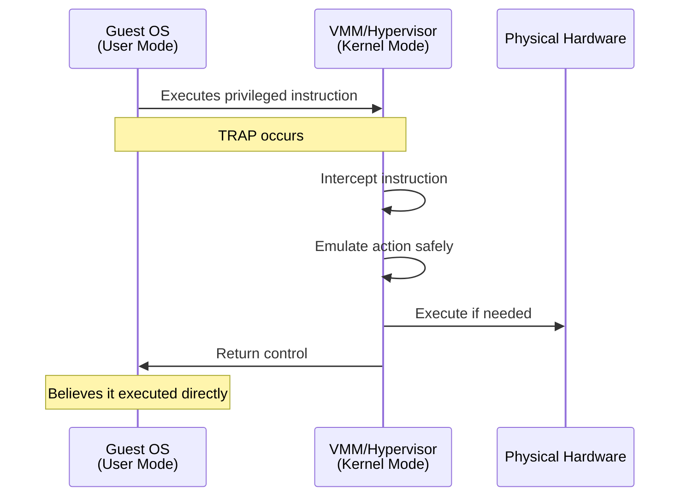

**Key Principles**

1. **VMM runs in kernel mode** (highest privilege)
2. **Guest OS runs in user mode** (restricted)
3. **Privileged instructions trigger trap** to VMM
4. **VMM emulates** the instruction without affecting host

**Analogy**: A tourist (Guest OS) wants to touch a museum exhibit (privileged hardware). Instead of direct access, they signal a tour guide (VMM). The guide performs the action or shows a replica, keeping the real exhibit safe while the tourist feels they had full access.

**Benefits**

- Guest OS remains unmodified (thinks it controls hardware)
- VMM maintains isolation between VMs
- Physical hardware protected from malicious/buggy guests

### Hypervisor Types

| Type | Description | Examples | Use Case |
|---|---|---|---|
| **Type 1 (Bare Metal)** | Runs directly on hardware | Xen, VMware ESXi, Hyper-V | Production data centers |
| **Type 2 (Hosted)** | Runs on host OS | VMware Workstation, VirtualBox | Development/testing |

**Xen Architecture**

- Micro-kernel hypervisor separating policy from mechanism
- **Domain 0**: Privileged guest OS managing hardware and resources
- **Domain U**: Unprivileged guest VMs

### Virtualization Types

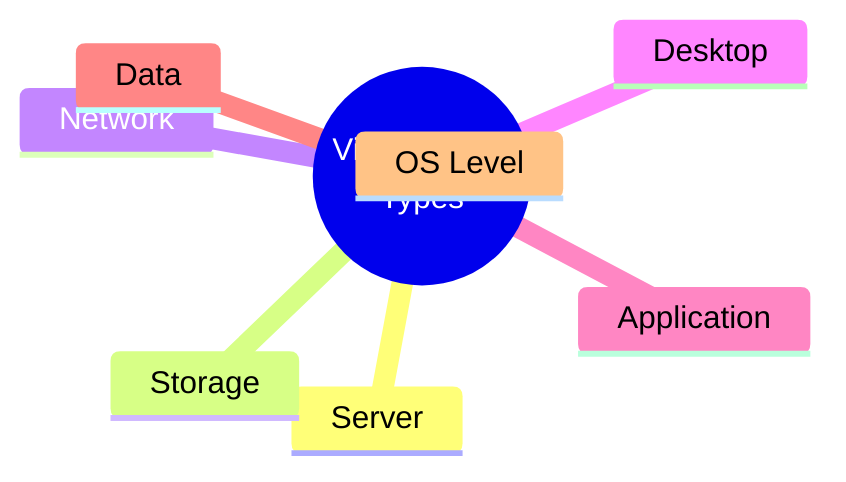

- **Server**: Divide physical server into isolated virtual servers
- **Storage**: Pool storage devices into virtual storage managed centrally
- **Network**: Virtual switches, routers, firewalls on physical network
- **Desktop**: Remote desktop access from any device
- **Application**: Apps run remotely, accessed like local apps
- **Data**: Aggregate data from multiple sources, present unified view
- **OS-Level**: Containers sharing same OS kernel

### Storage Types in IaaS

| Storage Type | Structure | Access Method | Use Cases | Examples |
|---|---|---|---|---|
| **Object Storage** | Flat namespace, objects with metadata & unique ID | APIs (not file system) | Backups, archives, media files, big data | Amazon S3, Azure Blob |
| **Volume Storage** | Block-level (virtual hard drives) | Attached to VMs like physical disks | Databases, OS storage, high I/O apps | Amazon EBS, Azure Disks |
| **File Storage** | Hierarchical files/folders | NFS/SMB mount paths | Shared content, home directories, web servers | Amazon EFS, Azure Files |

<!-- illustration: three storage types shown as different structures - object as scattered items with IDs, volume as hard drive block, file as folder tree -->

**Key Interactions**

- **Snapshots**: Instant backups of volumes stored in object storage
- **Images**: Pre-defined OS volumes in object storage used to launch instances

### IaaS Security Challenges

**Storage/Data Risks**

- Cloud admins can potentially access any data over network
- Snapshots are portable and easily exposed
- APIs and networks manage everything (attack surface)
- Ephemeral storage may leave sensitive data behind

**Virtualization Risks**

- **VM Escape**: Attacker breaks out of VM to access hypervisor or other VMs
- **VM Image Sharing**: Malicious code in uploaded images
- **Hypervisor Vulnerabilities**: Bugs allowing privileged access
- **Insufficient VM Isolation**: Shared resources enable cross-VM attacks

**Network Risks**

- Super-user access enables IP/MAC spoofing and sniffing
- Virtual network traffic invisible to physical security tools
- DoS attacks on virtual networks
- Security misconfigurations

### Security Solutions

**Encryption**

- **Instance-managed**: Engine + keys stored in VM (protected by passphrase)
- **Externally-managed**: Keys stored in HSM/key management service
- **Proxy encryption**: Dedicated encryption proxy between storage and app

**Data Dispersion (Alternative to Encryption)**

Data dispersion provides security and availability without encryption overhead:

**Mechanism**

1. Split file into **n fragments**
2. Digitally sign each fragment
3. Distribute fragments to **n remote servers**
4. To reconstruct: retrieve **m fragments** (where m < n)

**Security Model**

- Attacker must compromise **multiple specific nodes** to retrieve meaningful data
- No single server holds complete file
- Different from RAID (which focuses on redundancy, not security)

**Availability Benefit**

- File accessible even if some nodes fail
- Need only **m out of n** fragments (e.g., 5 out of 8)
- Handles server outages gracefully

**Tradeoff**

- ✓ No encryption/decryption overhead
- ✓ Better availability than single-server storage
- ✗ Requires network coordination
- ✗ Not a substitute for encryption against eavesdropping

**NoHype Architecture**

**Concept**: Completely remove the hypervisor layer to eliminate attack surface

**Traditional Stack**

```
Guest VM → Hypervisor → Hardware
```

**NoHype Stack**

```
Guest VM → Hardware (direct)
```

**How It Works**

- VMs run directly on partitioned physical hardware
- Pre-allocates resources at VM creation (no dynamic sharing)
- Removes hypervisor as potential vulnerability point

**Benefits**

- Eliminates VM escape attacks
- No hypervisor vulnerabilities to exploit
- Better performance (no hypervisor overhead)

**Limitations**

- Less flexible resource management
- Reduced VM density
- Sacrifices elasticity for security

---

## Chapter 3: Platform as a Service (PaaS)

### Core Concept

- **PaaS**: Cloud platform providing development environment without managing infrastructure
- Developers focus on code; provider handles servers, OS, databases, runtime
- Supports multiple languages and frameworks

### Major PaaS Providers

| Platform | Key Features | Supported Languages |
|---|---|---|
| **Google App Engine** | NoSQL datastore, Cloud SQL, auto-scaling | Java, Python, PHP, Go |
| **Azure App Service** | Managed infrastructure, CI/CD, cross-platform | .NET, Java, Python, Node.js, PHP |
| **Heroku** | Developer-friendly, Git-based deployment, dynos | Ruby, Node.js, Python, Java, PHP |
| **AWS Elastic Beanstalk** | Auto-provisioning, load balancing, EC2 integration | Java, .NET, Python, Node.js, PHP, Ruby, Go |

### Scaling in PaaS

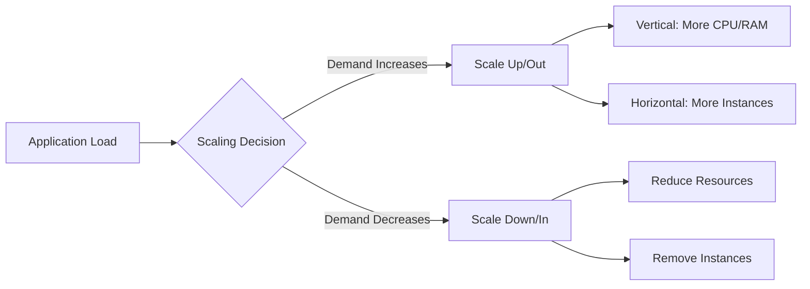

**Types of Scaling**

| Type | Method | Example |
|---|---|---|
| **Vertical (Scale Up)** | Increase resources of single server | 2 CPUs → 8 CPUs |
| **Horizontal (Scale Out)** | Add more server instances | 1 instance → 5 instances |

**Auto-Scaling Triggers**

- CPU utilization
- Request rate
- Queue length
- Custom metrics

### Load Balancing

**Purpose**: Distribute traffic across multiple servers to prevent bottlenecks

**Algorithms**

- **Round Robin**: Sequential distribution
- **Least Connections**: Route to server with fewest active connections
- **IP Hash**: Client IP determines server assignment

**Benefits**

- High availability (failover to healthy servers)
- Fault tolerance
- Reduced latency
- Optimized resource utilization

<!-- illustration: load balancer in center distributing arrows to 4 servers -->

### Scaling + Load Balancing Workflow

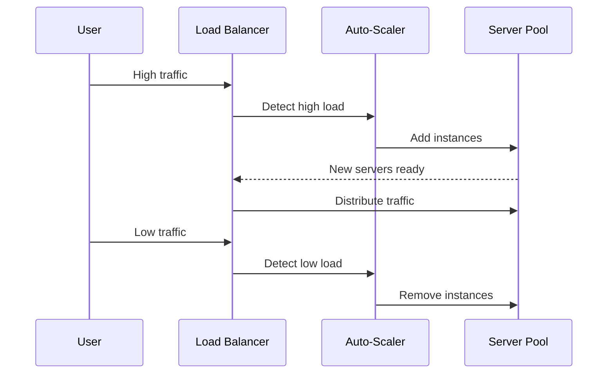

---

## Containerization & Docker

### What is Containerization?

- **Containerization**: Packaging app + dependencies into self-contained, portable unit
- Ensures consistency across environments (dev → test → prod)
- Lightweight alternative to full VMs

### Containers vs VMs

| Aspect | Containers | Virtual Machines |
|---|---|---|
| **OS** | Share host OS kernel | Each has full OS |
| **Size** | Lightweight (MBs) | Heavy (GBs) |
| **Startup** | Seconds | Minutes |
| **Isolation** | Process-level | Hardware-level |
| **Resource Use** | Minimal overhead | More overhead |

<!-- illustration: side-by-side comparison showing containers stacked on single OS vs VMs each with separate OS on hypervisor -->

### Docker Architecture

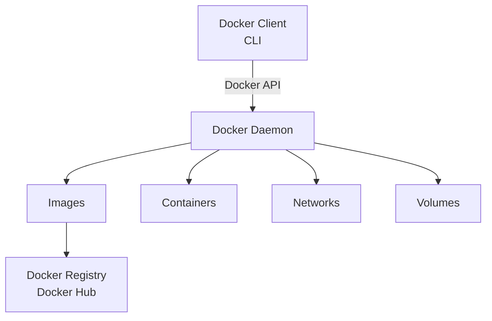

**Core Components**

- **Docker Daemon**: Background process managing images, containers, networks, volumes
- **Docker CLI**: Command-line interface for Docker commands
- **Docker Image**: Read-only template (static) with app + dependencies
- **Docker Container**: Running instance of image (dynamic, mutable)

### Docker Layered Architecture (Read/Write)

**How Containers Handle Data Changes**

When a container starts, Docker creates a layered filesystem:

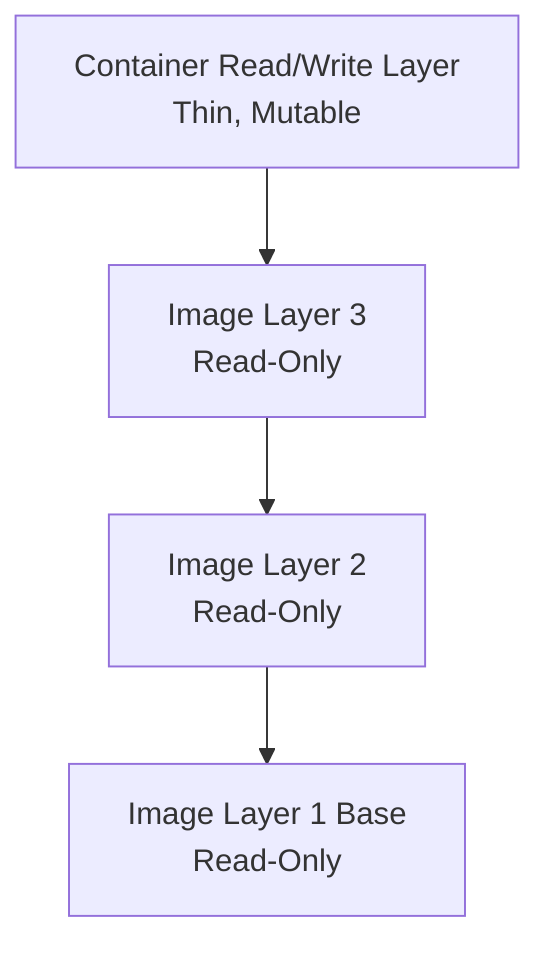

**Key Principles**

| Layer Type | Mutability | Purpose | Lifespan |
|---|---|---|---|
| **Image Layers** | Read-only | Store base OS, dependencies, app code | Permanent (until image deleted) |
| **Container Layer** | Read/write | Store runtime changes, temp files, logs | Ephemeral (deleted with container) |

**What Happens During Execution**

1. Docker takes the **read-only image**
2. Adds a **thin read/write layer** on top
3. All file changes happen in the **top layer only**
4. Base image remains **unchanged and shareable**

**Benefits**

- Multiple containers share same base image layers (saves space)
- Fast container creation (just add thin layer)
- Image integrity maintained (read-only base)
- Easy rollback (discard container layer)

**Example**: 10 containers from same image share base layers but each has independent writable layer for runtime data.

### Docker Workflow

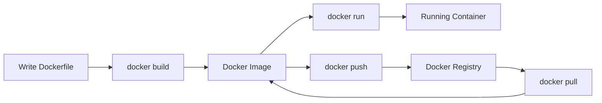

### Dockerfile Structure

```dockerfile
# Base Image
FROM ubuntu:20.04

# Environment Variables
ENV APP_ENV=production

# Working Directory
WORKDIR /app

# Copy Files
COPY requirements.txt .

# Run Commands
RUN pip install -r requirements.txt

# Expose Port
EXPOSE 5000

# Startup Command
CMD ["python", "app.py"]
```

### Key Docker Commands

| Command | Purpose |
|---|---|
| `docker build -t <name>` | Build image from Dockerfile |
| `docker run -p <port> <image>` | Run container from image |
| `docker images` | List all images |
| `docker ps` | List running containers |
| `docker stop <id>` | Stop container |
| `docker rm <id>` | Remove container |
| `docker pull <image>` | Download image from registry |
| `docker push <image>` | Upload image to registry |

### Docker Compose: Orchestrating Multiple Services

**Purpose**: Run and manage multiple containers as a single application

**Use Cases**

- Microservices architectures (web server + database + cache)
- Development environments with multiple dependencies
- Testing multi-component applications

**docker-compose.yml Example**

```yaml
version: '3'
services:
  web:
    build: ./web
    ports:
      - "5000:5000"
    depends_on:
      - db
  
  db:
    image: postgres:13
    environment:
      POSTGRES_PASSWORD: secret
    volumes:
      - db-data:/var/lib/postgresql/data

volumes:
  db-data:
```

**Key Commands**

| Command | Purpose |
|---|---|
| `docker-compose up` | Start all services defined in YAML |
| `docker-compose down` | Stop and remove all services |
| `docker-compose ps` | List running services |
| `docker-compose logs` | View logs from all services |

**Benefits**

- Define entire application stack in single file
- Start/stop all services with one command
- Automatic network creation between services
- Simplifies local development of microservices

### Docker Benefits in PaaS

| Benefit | Explanation |
|---|---|
| **Consistency** | Same container runs identically everywhere |
| **Portability** | Move easily between dev/test/prod and cloud platforms |
| **Efficiency** | Share OS kernel, fast startup, low resource use |
| **Isolation** | Apps run independently without interference |
| **Scalability** | Easily run multiple instances and auto-scale |
| **Microservices** | Ideal for small, modular services |

### Microservices and Serverless Architectures

**Microservices Pattern**

- Break large applications into **small, independent components**
- Each service handles specific business function
- Services deployed and scaled independently
- Communicate via APIs (typically REST or message queues)

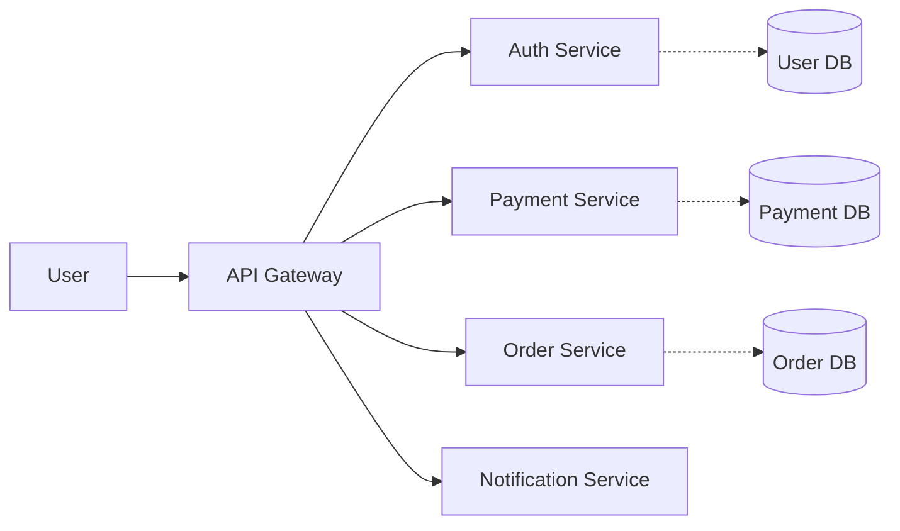

**Serverless + Microservices**

**AWS Fargate** (Serverless container platform)

- Run containers without managing servers
- Auto-scales based on demand
- Pay only for resources used (no idle server costs)

**Key Advantages**

- Independent deployment (update one service without affecting others)
- Technology flexibility (each service can use different language/framework)
- Fault isolation (one service failure doesn't crash entire app)
- Team autonomy (different teams own different services)

**Example**: E-commerce platform with separate containers for user authentication, product catalog, shopping cart, payment processing, and order fulfillment—each scaled independently based on load.

### Port Mapping Example

```bash
# Without port mapping (inaccessible)
docker run nginx

# With port mapping (accessible on localhost:80)
docker run -p 80:80 nginx
```

---

## Other XaaS Models

| Model | Description | Example |
|---|---|---|
| **AaaS** | Analytics as a Service | Outlier |
| **DaaS** | Desktop as a Service | Citrix |
| **FaaS** | Functions as a Service (Serverless) | AWS Lambda, Azure Functions |
| **STaaS** | Storage as a Service | Dropbox, Google Drive |

---

## Other XaaS Models

| Model | Description | Example |
|---|---|---|
| **AaaS** | Analytics as a Service | Outlier |
| **DaaS** | Desktop as a Service | Citrix |
| **FaaS** | Functions as a Service (Serverless) | AWS Lambda, Azure Functions |
| **STaaS** | Storage as a Service | Dropbox, Google Drive |

---

## Chapter 4: Software as a Service (SaaS)

### Definition and Model

- **SaaS**: Software delivery model where applications and data are hosted centrally and accessed via the internet (typically through a browser)
- Eliminates need for local installation or hardware management
- **Pricing**: Subscription-based or pay-as-you-go models

### Advantages vs Challenges

| Advantages | Challenges |
|---|---|
| ✓ Lower upfront costs | ✗ Reduced robustness vs desktop apps |
| ✓ Rapid scalability | ✗ Privacy and data security risks |
| ✓ Easy collaboration | ✗ Internet dependency |
| ✓ Automatic updates (typically every ~2 weeks) | ✗ Vendor lock-in |
| ✓ Accessible from anywhere | ✗ Limited customization |

### Robustness: Browser vs Desktop Applications

**Browser Limitations**

| Aspect | Desktop Apps (e.g., Microsoft Office) | SaaS Apps (e.g., Google Docs) |
|---|---|---|
| **Offline Functionality** | Full feature access without internet | Limited or no offline access |
| **Feature Completeness** | Excel: 500+ functions | Google Sheets: ~400 functions |
| **Performance** | Handles large datasets efficiently | Degrades with large files |
| **Advanced Features** | Complex macros, VBA scripting | Restricted macro capabilities |
| **Formatting** | Comprehensive formatting options | Simplified formatting tools |

**When to Choose Which**

- **SaaS**: Real-time collaboration, accessibility, automatic backups
- **Desktop**: Advanced features, offline work, large-scale data processing

### Service-Oriented Architecture (SOA)

SaaS applications rely on SOA, which breaks monolithic applications into independent, reusable services that communicate over a network.

**The Translation Layer**

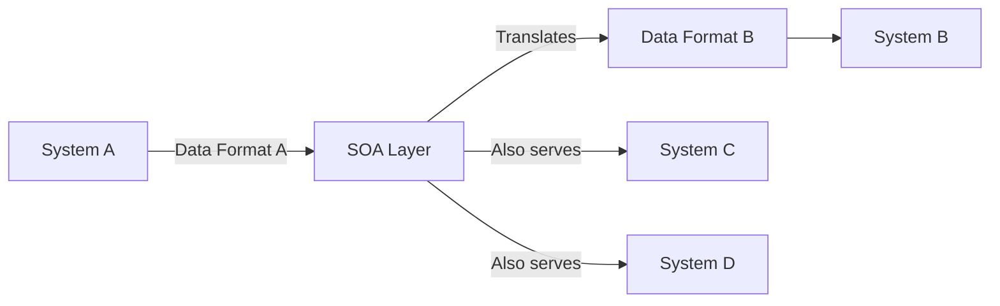

**How It Works**

- System A sends data to SOA layer
- SOA transforms data into format System B understands
- Systems remain **decoupled**: Changes to one don't break others
- If System B fails, System A continues operating

**Key Principles**

| Principle | Description |
|---|---|
| **Independence** | Services operate autonomously |
| **Reusability** | Same service used by multiple consumers |
| **Scalability** | Services scale independently |
| **Loose Coupling** | Minimal dependencies between services |

### Multi-Tenancy Architecture

Multi-tenancy allows a single software instance to serve multiple client organizations (tenants) while maintaining data isolation.

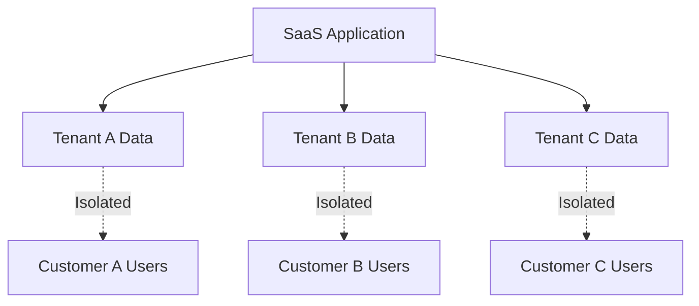

### Multi-Tenancy Models

| Architecture Type | Description | Pros | Cons |
|---|---|---|---|
| **Shared App + Shared DB** | All tenants share one app instance and database (data separated by tenant IDs) | ✓ Cheapest<br>✓ Most scalable<br>✓ Easy maintenance | ✗ Lowest isolation<br>✗ "Noisy neighbor" issues<br>✗ Limited customization |
| **Shared App + Separate DB** | Shared app instance, dedicated database per tenant | ✓ Better security<br>✓ Easier compliance<br>✓ Custom schemas possible | ✗ Higher cost<br>✗ More complex backups<br>✗ Harder to scale |
| **Separate App + Separate DB** | Dedicated app instance and database per tenant | ✓ Highest security<br>✓ Full customization<br>✓ Used by banks/government | ✗ Most expensive<br>✗ Complex management<br>✗ Resource-intensive |

**The "Noisy Neighbor" Problem**

- Occurs in shared infrastructure models
- One tenant consuming excessive resources (CPU, memory, bandwidth) degrades performance for other tenants
- Example: Tenant A runs intensive report, slowing down Tenant B's response times
- **Mitigation**: Resource quotas, rate limiting, usage monitoring

### Authentication and Authorization

**Authentication (AuthN): Verifying Identity**

Modern SaaS uses multiple authentication methods:

| Method | Description | Example |
|---|---|---|
| **Multi-Factor Authentication (MFA)** | Requires 2+ verification factors | Password + SMS code |
| **Single Sign-On (SSO)** | One login for multiple services | Google account accessing Gmail, Drive, Calendar |
| **SAML 2.0** | XML-based standard for SSO | Enterprise login portals |
| **OAuth 2.0** | Authorization framework for delegated access | "Login with Google" button |

**Authorization (AuthZ): Determining Permissions**

- Controls **what** authenticated users can do
- Often implemented using **Bearer Tokens** (e.g., JWT - JSON Web Tokens)
- Token acts as digital key checked on every request

**Typical Flow**

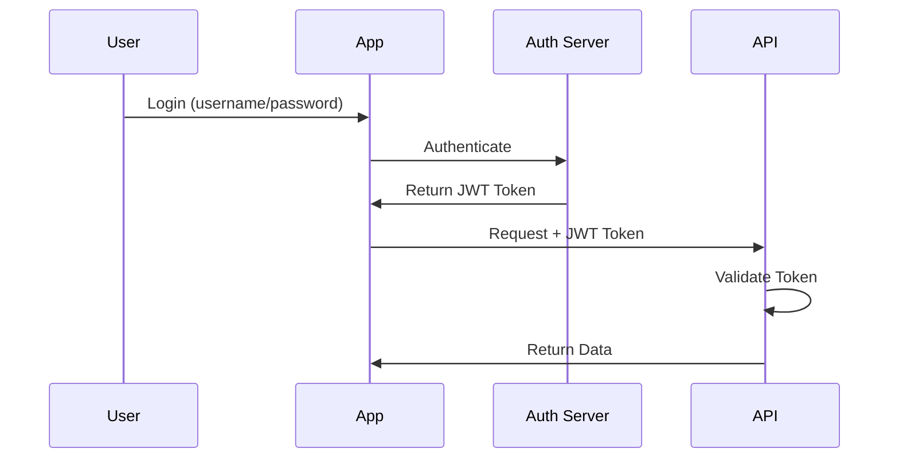

### API Integration

APIs enable SaaS applications to communicate and share data.

**API Types**

| Type | Description | Use Case |
|---|---|---|
| **REST** | Uses HTTP methods (GET, POST, PUT, DELETE) with JSON | Most common, stateless communication |
| **Webhooks** | Event-driven push notifications | Real-time updates (payment success, form submission) |
| **GraphQL** | Query language for flexible data fetching | Mobile apps needing specific data subsets |

**Example: Salesforce → Mailchimp Integration**

**Step-by-Step Workflow**

1. **Trigger**: New lead created in Salesforce
2. **API Call**: Salesforce webhook sends lead data (JSON) to middleware
3. **Transformation**: Middleware formats data for Mailchimp API structure
4. **Delivery**: POST request to Mailchimp `/lists/{list_id}/members` endpoint
5. **Confirmation**: Mailchimp returns success (200 OK) or failure response
6. **Action**: New subscriber appears in Mailchimp list

**Sample JSON Payload**

```json
{
  "email_address": "user@example.com",
  "status": "subscribed",
  "merge_fields": {
    "FNAME": "John",
    "LNAME": "Doe",
    "COMPANY": "Acme Corp"
  }
}
```

### Privacy and Compliance

**GDPR and Privacy Requirements**

**Key GDPR Principles for SaaS**

| Requirement | Description | SaaS Implementation |
|---|---|---|
| **Explicit Consent** | Users must opt-in to data collection | Consent checkboxes, not pre-selected |
| **Right to Access** | Users can request all stored data | Data export functionality |
| **Right to Rectification** | Users can correct inaccurate data | Profile editing features |
| **Right to Erasure** | "Right to be forgotten" | Account deletion with data purge |
| **Data Portability** | Export data in machine-readable format | CSV/JSON download options |
| **Breach Notification** | Report breaches within 72 hours | Automated monitoring + notification systems |

**Penalties**

- Up to **€20 million** or **4% of global annual revenue** (whichever is higher)
- Applies to any company processing EU citizen data (regardless of company location)

**SaaS Provider Responsibilities**

- **Data encryption** in transit (TLS) and at rest
- **Access controls** limiting who can view personal data
- **Audit logs** tracking all data access
- **Data Processing Agreements (DPA)** with customers
- **Privacy by design** embedded in development

---

## Chapter 5: Cloud Native Technologies & Architectures

### Cloud Native Definition

**Cloud Native** ≠ Simply hosting legacy apps in the cloud

**True Cloud Native**:

- Applications **built specifically for** cloud environments
- Designed for elasticity, resilience, and continuous deployment
- Leverages microservices, containers, and dynamic orchestration

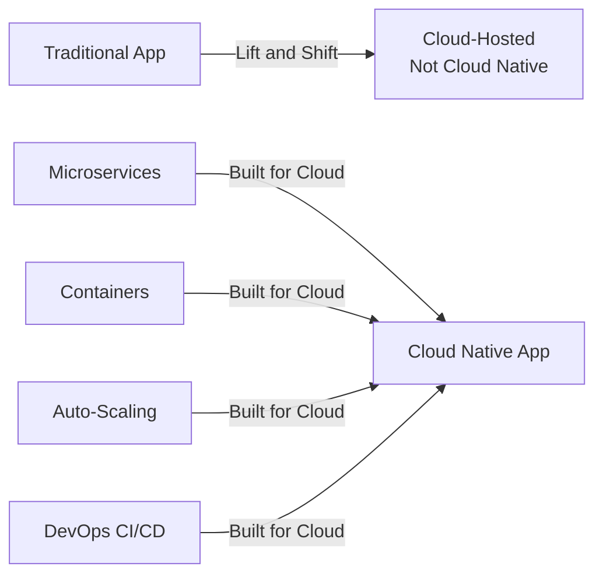

### Microservices Architecture

**Concept**: Split monolithic "single codebase" application into small, independent services based on business functions.

**E-Commerce Microservices Breakdown**

| Service | Responsibility | Tech Stack Example | Database |
|---|---|---|---|
| **User Service** | Authentication, profiles, sessions | Node.js + Express | MongoDB |
| **Product Service** | Catalog, inventory, search | Python + Flask | PostgreSQL |
| **Order Service** | Cart, checkout, payment processing | Java + Spring Boot | MySQL |
| **Notification Service** | Emails, SMS, push notifications | Go + gRPC | Redis (queue) |
| **Shipping Service** | Tracking, logistics, delivery | Ruby on Rails | PostgreSQL |

**Key Point**: Each service has its own database and can be deployed independently.

**Service Communication**

**Synchronous Communication** (Direct API calls)

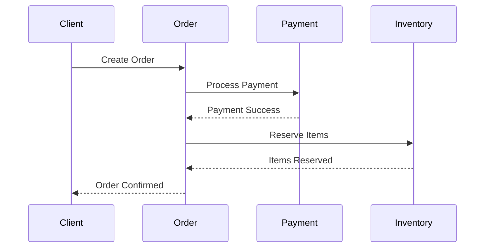

- Fast, real-time responses
- Services wait for responses (blocking)
- Example: HTTP/REST, gRPC

**Asynchronous Communication** (Message Brokers)

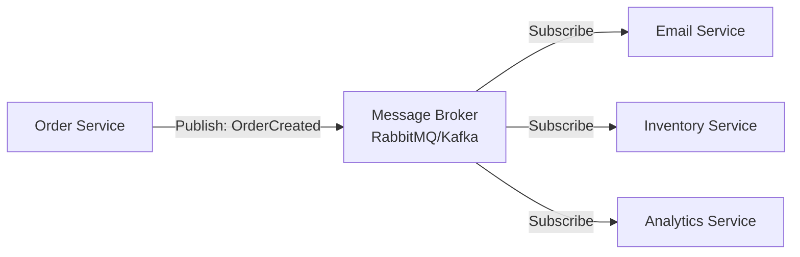

- Decoupled services (no direct dependencies)
- Fire-and-forget pattern
- Better fault tolerance

**Benefits of Microservices**

| Benefit | Explanation |
|---|---|
| **Fault Isolation** | If Order service fails, User service keeps working |
| **Independent Deployment** | Update Payment service without touching other services |
| **Technology Flexibility** | Each service can use different languages/frameworks |
| **Team Autonomy** | Different teams own different services |
| **Scalability** | Scale only the services under heavy load |

### Serverless Computing (FaaS + BaaS)

**Concept**: Developers upload code (Functions), cloud provider handles all infrastructure. Scales to zero when idle.

**Composition**

**FaaS (Function as a Service)**

- Event-driven code execution
- No server management
- Pay only for execution time
- Examples: AWS Lambda, Azure Functions, Google Cloud Functions

**BaaS (Backend as a Service)**

- Managed backend functionality (Auth, Database, Storage)
- Accessed via APIs
- Examples: Firebase, AWS Amplify, Supabase

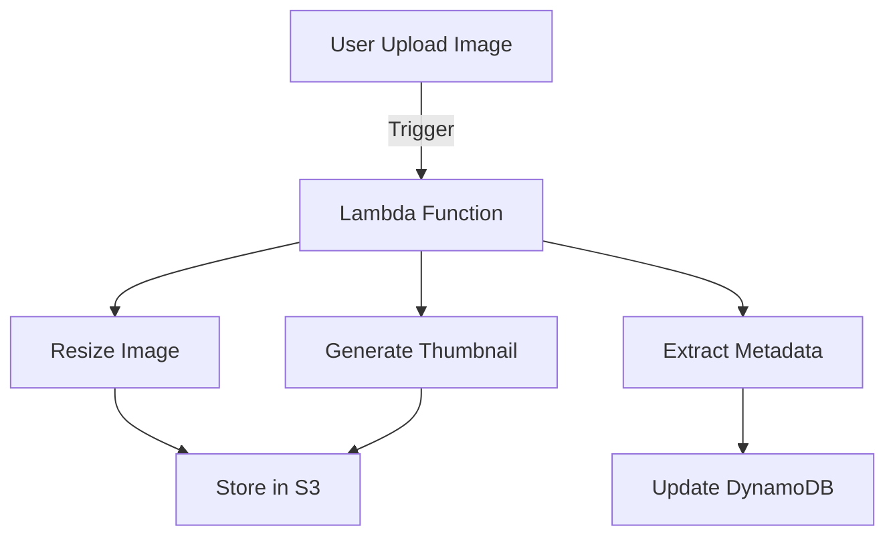

**Serverless Characteristics**

| Characteristic | Description |
|---|---|
| **Auto-scaling** | Scales from 0 to 1000s of instances automatically |
| **Pay-per-use** | Charged only for execution time (milliseconds) |
| **Stateless** | Each invocation is independent |
| **Event-driven** | Triggered by HTTP, file uploads, database changes, schedules |

**Cold Start Problem**

- **Issue**: First request after idle period experiences delay
- **Cause**: Provider must provision resources (container, runtime)
- **Typical Delay**: 100ms - 3 seconds
- **Mitigation**: Keep functions "warm" with scheduled pings, provisioned concurrency

### API Gateways

**Purpose**: Single entry point for client requests, routing to correct microservices.

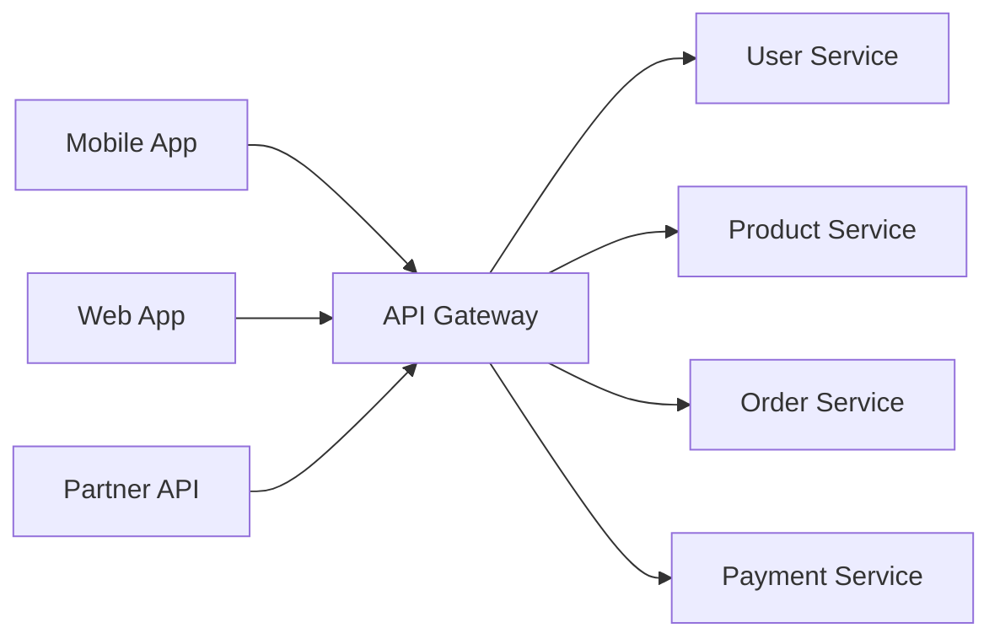

**API Gateway Responsibilities**

| Function | Description |
|---|---|
| **Routing** | Directs requests to appropriate microservice |
| **Authentication** | Validates JWT tokens, API keys |
| **Rate Limiting** | Prevents abuse (e.g., 100 requests/minute) |
| **SSL Termination** | Handles HTTPS encryption/decryption |
| **Response Transformation** | Formats responses for different clients |
| **Caching** | Stores frequent responses to reduce backend load |

**Backend for Frontend (BFF) Pattern**

Creating different gateways optimized for different client types:

```mermaid
flowchart TD
    A[Mobile App] --> B[Mobile BFF<br/>Lightweight responses]
    C[Web App] --> D[Web BFF<br/>Rich data]
    
    B --> E[Microservices Layer]
    D --> E
```

**Why Use BFF?**

- Mobile needs minimal data (bandwidth constraints)
- Web can handle more detailed responses
- Each BFF optimized for its client

### Service Mesh

**Definition**: Dedicated infrastructure layer managing **service-to-service** communication.

**Sidecar Pattern**

Every microservice instance gets a lightweight proxy (e.g., Envoy) alongside it. All traffic flows through the proxy.

```mermaid
flowchart TB
  subgraph SA[Service A Pod]
    A1[Application Container]
    A2[Envoy Sidecar Proxy]
    A1 <-->|localhost| A2
  end
  
  subgraph SB[Service B Pod]
    B1[Application Container]
    B2[Envoy Sidecar Proxy]
    B1 <-->|localhost| B2
  end
  
  subgraph SC[Service C Pod]
    C1[Application Container]
    C2[Envoy Sidecar Proxy]
    C1 <-->|localhost| C2
  end
  
  A2 <-->|mTLS Encrypted| B2
  B2 <-->|mTLS Encrypted| C2
  A2 <-->|mTLS Encrypted| C2
  
  CP[Control Plane<br/>Istio/Linkerd]
  
  CP -.->|Config & Policies| A2
  CP -.->|Config & Policies| B2
  CP -.->|Config & Policies| C2
  
  A2 -.->|Metrics & Traces| CP
  B2 -.->|Metrics & Traces| CP
  C2 -.->|Metrics & Traces| CP
```

**All traffic goes through sidecars** → Security, observability, traffic control without changing app code.

**Service Mesh Capabilities**

| Feature | Description | Benefit |
| --- | --- | --- |
| **mTLS (Mutual TLS)** | Automatic encryption between services | Zero-trust security |
| **Traffic Management** | Canary deployments, A/B testing | Gradual rollouts |
| **Retries & Timeouts** | Automatic retry on failure | Improved reliability |
| **Observability** | Distributed tracing, metrics | Debugging microservices |
| **Circuit Breaking** | Stop calling failing services | Prevent cascading failures |

**Popular Service Mesh Tools**: Istio, Linkerd, Consul

### Orchestration: Kubernetes (K8s)

**Kubernetes**: Automates deployment, scaling, and management of containerized applications.

**Kubernetes: The Cluster Orchestrator**

Think of Kubernetes as a **data center operating system**:

| Kubernetes Component | OS Analogy | Function |
| --- | --- | --- |
| **Control Plane** | Kernel | Makes decisions, manages state |
| **Worker Nodes** | CPU cores | Runs workloads |
| **Pods** | Processes | Smallest unit of work |
| **Services** | DNS | Stable networking for Pods |
| **Deployments** | Systemd services | Desired state management |

**Analogy**: If Docker is a shipping container, Kubernetes is the entire port logistics system (cranes, trucks, scheduling, routing).

### Kubernetes Cluster Architecture

```mermaid
flowchart TB
    subgraph CP[Control Plane - The Brain]
        A[API Server<br/>Front door for all commands]
        B[etcd<br/>Key-value store cluster state]
        C[Scheduler<br/>Assigns Pods to Nodes]
        D[Controller Manager<br/>Maintains desired state]
    end
    
    subgraph N1[Worker Node 1]
        E[Kubelet<br/>Node agent]
        F[Kube-Proxy<br/>Network rules]
        G[Pods<br/>Running containers]
    end
    
    subgraph N2[Worker Node 2]
        H[Kubelet]
        I[Kube-Proxy]
        J[Pods]
    end
    
    A --> E
    A --> H
    E --> G
    H --> J
```

**Control Plane Components (The Brain)**

| Component | Role |
|---|---|
| **API Server** | Single entry point; only component that talks to etcd |
| **etcd** | Distributed database storing cluster state, secrets, configs |
| **Scheduler** | Decides which Node a Pod should run on (based on resources) |
| **Controller Manager** | Ensures desired state matches actual state (e.g., 3 replicas running) |

**Worker Node Components (The Muscle)**

| Component | Role |
|---|---|
| **Pod** | Smallest deployable unit; wrapper around one or more containers |
| **Kubelet** | Agent ensuring containers are running as requested |
| **Kube-Proxy** | Manages network rules and load balancing |

**Key Kubernetes Objects**

```yaml
# Deployment: Desired state for Pods
apiVersion: apps/v1
kind: Deployment
metadata:
  name: web-app
spec:
  replicas: 3  # Keep 3 Pods running
  template:
    spec:
      containers:
      - name: nginx
        image: nginx:1.21
        ports:
        - containerPort: 80
---
# Service: Stable networking
apiVersion: v1
kind: Service
metadata:
  name: web-service
spec:
  selector:
    app: web-app
  ports:
  - port: 80
    targetPort: 80
  type: LoadBalancer
```

### Infrastructure as Code (IaC)

**Concept**: Managing infrastructure via machine-readable configuration files rather than manual setup.

**Declarative vs Imperative**

| Approach | Description | Example Tool | Mental Model |
|---|---|---|---|
| **Declarative** | Specify **desired end state**, tool figures out how | Terraform, CloudFormation | "I want 3 servers" |
| **Imperative** | Specify **exact steps** to execute | Ansible, Bash scripts | "Create server 1, create server 2, create server 3" |

**Terraform Example (Declarative)**

```hcl
# Define desired state
resource "aws_instance" "web" {
  ami           = "ami-067c21fb1979f2d1c"
  instance_type = "t2.micro"
  count         = 3  # Want 3 instances
  
  tags = {
    Name = "WebServer-${count.index}"
  }
}
```

Run `terraform apply` → Terraform calculates what needs to be created/changed/destroyed.

**Benefits of IaC**

| Benefit | Description |
|---|---|
| **Version Control** | Infrastructure changes tracked in Git |
| **Repeatability** | Deploy identical environments (dev/staging/prod) |
| **Automation** | Integrate with CI/CD pipelines |
| **Documentation** | Code serves as infrastructure documentation |
| **Collaboration** | Teams can review/approve infrastructure changes |

---

## Chapter 6: Cloud Security & Best Practices

### The Shared Responsibility Model

Security is **shared** between Cloud Service Provider (CSP) and customer.

```mermaid
flowchart TB
    subgraph Customer[Customer Responsibility]
        A[Data]
        B[Applications]
        C[Identity & Access]
        D[Operating System]
        E[Network Configuration]
    end
    
    subgraph Shared[Varies by Service]
        F[Firewall Configuration]
        G[Encryption]
    end
    
    subgraph CSP[CSP Responsibility]
        H[Physical Security]
        I[Hardware]
        J[Network Infrastructure]
        K[Virtualization Layer]
    end
```

**Responsibility by Service Model**

| Layer | IaaS | PaaS | SaaS |
|---|---|---|---|
| **Data** | Customer | Customer | Customer |
| **Applications** | Customer | Customer | CSP |
| **Runtime** | Customer | CSP | CSP |
| **Operating System** | Customer | CSP | CSP |
| **Virtualization** | CSP | CSP | CSP |
| **Physical Hardware** | CSP | CSP | CSP |

**Key Insight**:

- **IaaS**: Customer manages OS, firewall, apps, data
- **SaaS**: Customer manages only user access (IAM) and data usage
- CSP **always** manages physical infrastructure

### Network Security: Security Groups

**Definition**: Stateful virtual firewalls acting at the **instance/resource level** (not subnet level).

**Stateful Nature**

- If **inbound** request allowed (e.g., port 80), **outbound** response is **automatically** permitted
- No need to create explicit outbound rule for return traffic

**Example: Three-Tier Web App Security Groups**

```mermaid
flowchart TD
    A[Internet] -->|HTTPS 443| B[Load Balancer SG]
    B -->|HTTP 80| C[Web Tier SG]
    C -->|App Traffic 3000| D[App Tier SG]
    D -->|PostgreSQL 5432| E[Database SG]
    
    E -.->|No Outbound| F[Deny All]
```

**Concrete AWS Security Group Configuration**

**Load Balancer SG** (`sg-lb-001`)

```
Inbound:
  - Protocol: HTTPS (443)
    Source: 0.0.0.0/0 (Internet)
    
Outbound:
  - Protocol: HTTP (80)
    Destination: sg-web-001
```

**Web Tier SG** (`sg-web-001`)

```
Inbound:
  - Protocol: HTTP (80)
    Source: sg-lb-001 (only from load balancer)
    
Outbound:
  - Protocol: Custom TCP (3000)
    Destination: sg-app-001
```

**App Tier SG** (`sg-app-001`)

```
Inbound:
  - Protocol: Custom TCP (3000)
    Source: sg-web-001 (only from web tier)
    
Outbound:
  - Protocol: PostgreSQL (5432)
    Destination: sg-db-001
```

**Database SG** (`sg-db-001`)

```
Inbound:
  - Protocol: PostgreSQL (5432)
    Source: sg-app-001 (only from app tier)
    
Outbound:
  - Deny all (database should not initiate outbound connections)
```

**Benefits of This Approach**

| Benefit | Explanation |
|---|---|
| **Zero Hardcoded IPs** | References security groups, not IP addresses |
| **Dynamic Security** | Works as instances scale up/down |
| **Principle of Least Privilege** | Each tier only talks to adjacent tiers |
| **Defense in Depth** | Multiple layers of security |

**Best Practices**

- **Allow-rules only** (no explicit deny needed)
- **Reference other Security Groups** instead of IP ranges
- **Principle of Least Privilege**: Only open necessary ports
- **Separate SGs per tier**: Don't use one SG for everything

### Identity and Access Management (IAM)

**Concept**: Identity is the new perimeter. Network boundaries blur in cloud; security relies on verifying **who** accesses resources.

**The 3 A's of Security**

```mermaid
flowchart LR
    A[User/Service] -->|1. Who are you?| B[Authentication AuthN]
    B -->|2. What can you do?| C[Authorization AuthZ]
    C -->|3. What did you do?| D[Accounting/Auditing]
    
    B -.->|MFA, Tokens| E[Identity Verified]
    C -.->|Policies, Roles| F[Permissions Granted]
    D -.->|Logs, Trails| G[Actions Recorded]
```

| Component | Function | Mechanism |
| --- | --- | --- |
| **Authentication (AuthN)** | Verifying identity | MFA, tokens, biometrics |
| **Authorization (AuthZ)** | Determining permissions | IAM policies, RBAC |
| **Accounting/Auditing** | Tracking actions | CloudTrail, access logs |

**Human vs Non-Human Identities**

| Identity Type | Examples | Authentication Method |
| --- | --- | --- |
| **Human** | Developers, admins, end users | Username/password, SSO, MFA |
| **Non-Human** | VMs, containers, CI/CD pipelines, Lambda functions | Service accounts, IAM roles, certificates |

**Critical Point**: Non-human identities also need managed permissions. A compromised container with overly broad permissions is a major security risk.

**IAM Policy Example (AWS)**

```json
{
  "Version": "2012-10-17",
  "Statement": [
    {
      "Effect": "Allow",
      "Action": [
        "s3:GetObject",
        "s3:PutObject"
      ],
      "Resource": "arn:aws:s3:::my-bucket/*"
    },
    {
      "Effect": "Deny",
      "Action": "s3:DeleteObject",
      "Resource": "*"
    }
  ]
}
```

**Principle of Least Privilege**: Grant only permissions needed for specific tasks.

### Data Compliance & Residency

**Data Residency vs Data Sovereignty**

| Aspect | Data Residency | Data Sovereignty |
|---|---|---|
| **Definition** | Physical location where data is stored | Legal jurisdiction governing the data |
| **Focus** | Geography | Law |
| **Example** | "Data stored in Frankfurt data center" | "Data subject to German GDPR enforcement" |
| **Control** | Customer chooses AWS/Azure region | Determined by storage location |
| **Risk** | Accidental cross-border transfer | Foreign government access (e.g., CLOUD Act) |

**Key Insight**: Data stored in EU (residency) may still be accessible to US authorities if the provider is US-based (sovereignty).

**Regulatory Frameworks**

| Regulation | Scope | Key Requirements |
|---|---|---|
| **GDPR** (EU) | Protects EU citizen data globally | Consent, right to erasure, breach notification |
| **CLOUD Act** (US) | US authorities can access US company data abroad | Applies to Microsoft, Google, Amazon data even if stored in EU |
| **HIPAA** (US Healthcare) | Protected Health Information (PHI) | Encryption, access controls, audit logs |
| **PCI DSS** (Payment Cards) | Credit card data | Network segmentation, encryption, monitoring |

**Data Sovereignty Scenario**

```
Company: European bank using AWS
Data Location: AWS eu-west-1 (Ireland)
CSP: Amazon (US company)

Result:
✓ Data Residency: EU ✓
✗ Data Sovereignty: Subject to US CLOUD Act
```

**Solution**: Use EU-based cloud providers (e.g., OVHcloud, Deutsche Telekom Cloud) for strict sovereignty requirements.

### Key Management

**Encryption Key Types**

| Key Type | Mechanism | Speed | Use Case |
|---|---|---|---|
| **Symmetric Keys** | Same key for encrypt/decrypt | Fast | Encrypting large data (AES-256) |
| **Asymmetric Keys** | Public/Private key pair | Slower | Identity verification, TLS handshakes (RSA) |

**Envelope Encryption**

**Concept**: Using a **Key Encryption Key (KEK)** to encrypt the **Data Encryption Key (DEK)**.

**Envelope Encryption Workflow**

```mermaid
sequenceDiagram
  participant App as Application
  participant KMS as Cloud KMS
  participant Storage as Data Storage
  
  Note over KMS: KEK (Master Key)<br/>Never leaves KMS
  
  App->>KMS: 1. Request Data Encryption Key
  KMS->>KMS: Generate DEK (plaintext)
  KMS->>KMS: Encrypt DEK with KEK
  KMS->>App: Return plaintext DEK + encrypted DEK
  
  App->>App: 2. Encrypt data with plaintext DEK
  App->>App: 3. Discard plaintext DEK from memory
  App->>Storage: 4. Store encrypted data + encrypted DEK
  
  Note over Storage: Encrypted Data<br/>+<br/>Encrypted DEK<br/>(both safe at rest)
  
  rect rgb(220, 240, 220)
  Note over App,Storage: Later: Decryption Process
  App->>Storage: Retrieve encrypted data + encrypted DEK
  App->>KMS: Send encrypted DEK
  KMS->>KMS: Decrypt DEK with KEK
  KMS->>App: Return plaintext DEK
  App->>App: Decrypt data with plaintext DEK
  App->>App: Discard plaintext DEK
  end
```

**Benefits**

| Benefit | Explanation |
|---|---|
| **DEK never stored in plaintext** | Plaintext DEK only exists briefly in memory during encryption/decryption |
| **KEK never leaves KMS** | Master key remains in secure hardware (HSM) |
| **Performance** | Only small DEK sent to KMS, not entire dataset |
| **Key rotation** | Rotate KEK without re-encrypting all data (just re-encrypt DEKs) |
| **Compromise protection** | Stolen encrypted data useless without access to KMS and KEK |

**Why Envelope Encryption?**

| Scenario | Without Envelope | With Envelope |
|---|---|---|
| **Encrypt 1GB file** | Send 1GB to KMS → Slow | Encrypt locally with DEK, only send DEK (32 bytes) to KMS → Fast |
| **Key Rotation** | Re-encrypt all data | Only re-encrypt DEK (instant) |
| **Security** | Master key used directly | Master key (KEK) never exposed |

**Key Lifecycle Management**

```mermaid
flowchart LR
    A[Generate Key] --> B[Activate Key]
    B --> C[Use Key]
    C -->|Regular Interval| D[Rotate Key]
    D --> C
    C -->|Compromise Detected| E[Revoke Key]
    E --> F[Archive Key]
    F --> G[Destroy Key]
```

| Phase | Action | Frequency |
|---|---|---|
| **Generation** | Create cryptographically strong key | On-demand |
| **Activation** | Make key available for use | Immediately after generation |
| **Rotation** | Replace with new key | Every 90 days (recommended) |
| **Revocation** | Immediately disable key | Upon compromise |
| **Destruction** | Permanently delete key | After retention period |

**Key Rotation Best Practices**

- **Automated rotation**: Every 30-90 days
- **Immediate revocation**: If compromise suspected
- **Maintain old keys**: For decrypting historical data
- **Audit key usage**: CloudTrail logs for all key operations

---

## Key Takeaways

✓ **Cloud Computing** = On-demand, scalable, pay-per-use IT resources over Internet  
✓ **Evolution**: Grid → Cluster → Utility → Cloud (virtualization + multi-tenancy)  
✓ **Amdahl's Law**: Parallelization limited by sequential bottleneck ($S \approx 1/\alpha$)  
✓ **Deployment Models**: Public (shared), Private (dedicated), Hybrid (mixed), Community (group)  
✓ **Service Models**: IaaS (infrastructure), PaaS (platform), SaaS (software)  

✓ **IaaS Core**: Virtualization (Trap & Emulate), hypervisors, storage (object/volume/file)  
✓ **Security**: Encryption, data dispersion, NoHype, isolation critical  
✓ **PaaS Core**: Auto-scaling, load balancing, managed infrastructure, developer focus  
✓ **Containerization**: Docker layers, Compose for orchestration, lightweight & portable  

✓ **SaaS**: Multi-tenancy models, SOA architecture, API integration (REST/webhooks)  
✓ **Cloud Native**: Microservices, serverless (FaaS), Kubernetes orchestration  
✓ **Service Mesh**: Sidecar proxies for mTLS, traffic management, observability  
✓ **IaC**: Declarative (Terraform) vs Imperative (Ansible) infrastructure management  

✓ **Security**: Shared responsibility model, security groups (stateful), IAM (3 A's)  
✓ **Compliance**: Data residency vs sovereignty, GDPR, CLOUD Act implications  
✓ **Key Management**: Symmetric/asymmetric keys, envelope encryption, rotation policies
