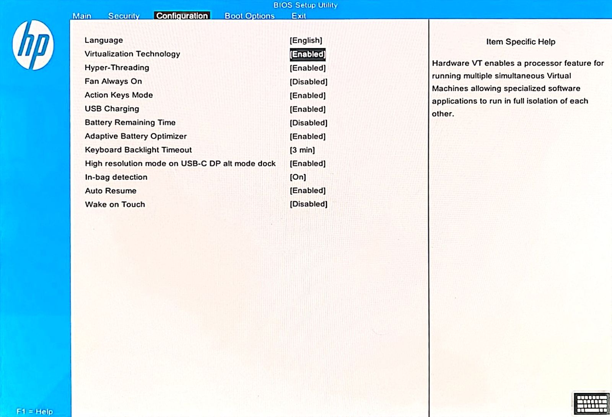
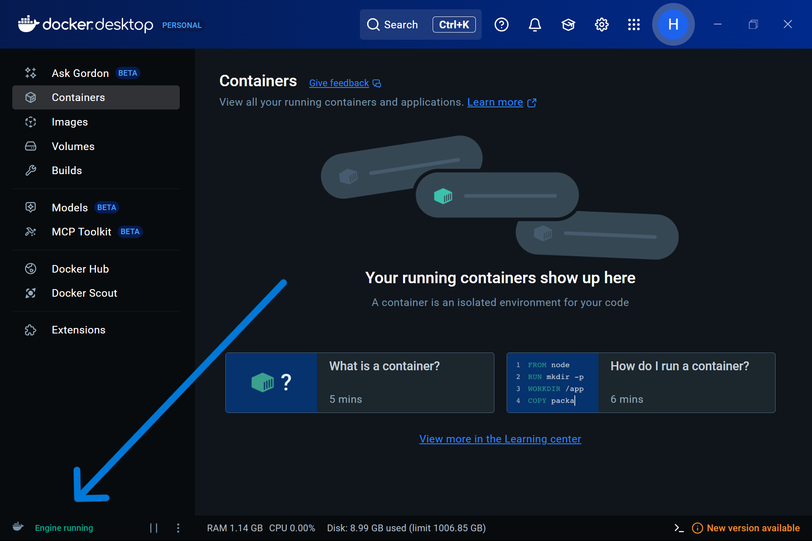
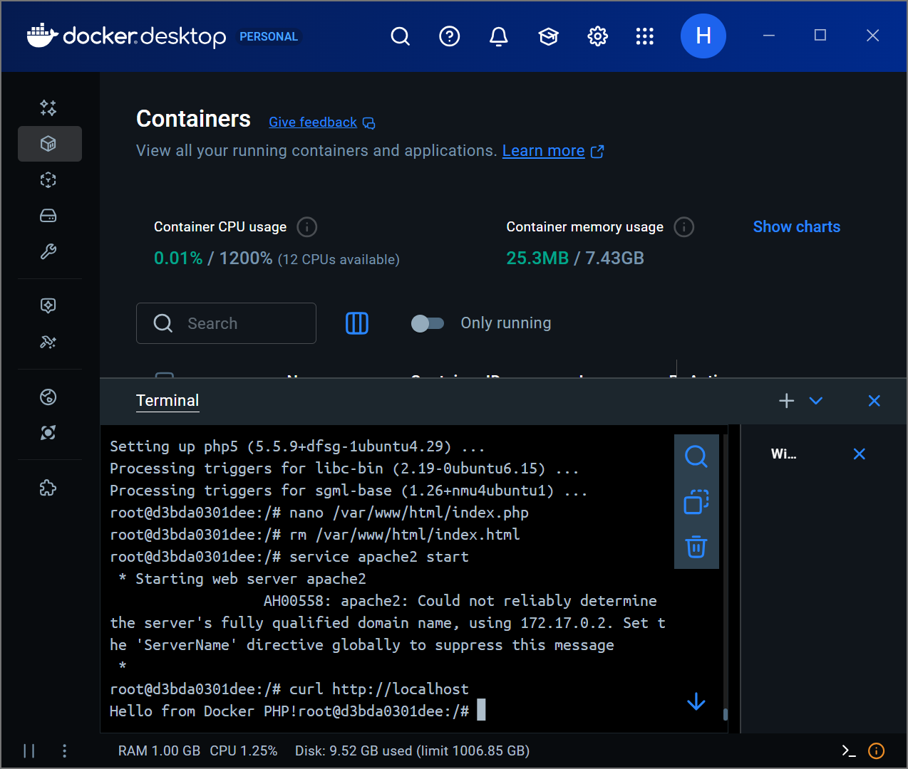
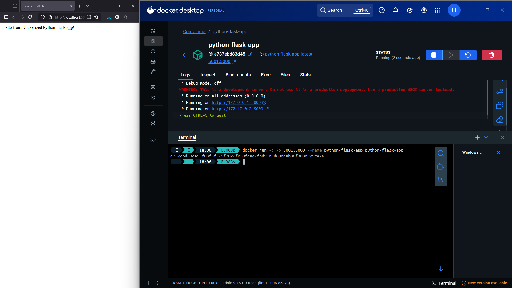

# Docker Lab Report  

**Course:** IN401- Cloud Computing
**Lab:** Virtualization with Docker Engine - OS-Level Virtualization  
**Instructor:** Dr. Mohammad Hamze  
**Date:** 13/11/2025

---

## 1. Team Information

| Member | Name | Student ID | Section |
|------|------|------------| --- |
| Student 1 | Hadi Hijazi | 105174 | French |

---

## 2. Lab Objectives

The purpose of this lab was to get hands-on experience with **Docker** as an OS-level virtualization tool on Windows 11. Concretely, we were asked to:

- Install and configure Docker Engine on Windows.
- Enable container-related features (Hyper-V, Windows containers).
- Run and manage containers from images pulled from Docker Hub.
- Deploy a simple web application inside a container.
- Reflect on the suitability of Docker for building applications (Java/Python or web apps in general).

---

## 3. Environment & Prerequisites

For this lab, I worked on a **Windows 11** machine (though the same steps should work on Windows 10). Here's what I needed:

- **Virtualization:** Intel VT-x enabled in BIOS
- **Container Runtime:** Docker Desktop for Windows with Hyper-V
- **Command Line:** PowerShell running as Administrator
- **Internet Access:** to pull images from Docker Hub

I also followed the official Docker Curriculum material that was referenced in the lab instructions.

---

## 4. Installation & Setup Steps

### 4.1 Enabling CPU Virtualization in BIOS

Before I could use Docker, I needed to enable hardware virtualization. Here's what I did:

1. Restarted the computer and pressed **F10** during boot to enter the BIOS setup.
2. Found the **Intel Virtualization Technology (VT-x)** option in the CPU settings.
3. Enabled it and saved the changes before exiting.

This was necessary because Windows needs Hyper-V to run Docker containers efficiently, and Hyper-V requires hardware virtualization support.
  
> 

---

### 4.2 Installing Docker Desktop on Windows

The installation process was pretty straightforward:

1. I went to **Docker Hub** (hub.docker.com) and downloaded Docker Desktop for Windows.
2. Ran the installer and accepted the default settings, which included enabling Hyper-V and installing necessary Windows components.
3. After installation finished, I launched Docker Desktop and waited for it to initialize.
4. Once I saw the "Docker Engine is running" status, I knew I was good to go.

> 

---

### 4.3 Enabling Windows Features for Docker

My system was running Windows Home, which doesn't natively support the full `containers` feature, so I needed to set up **WSL 2** (Windows Subsystem for Linux). I opened PowerShell as Administrator and ran:

```powershell
wsl --install
```

This command installs WSL 2 and configures everything Docker needs to run properly. After it finished, we had to restart the computer for the changes to take effect.

---

## 5. Verifying Docker with Basic Containers

### 5.1 `hello-world` Image

To verify the Docker installation, I pulled and ran the official `hello-world` image.

```bash
docker pull hello-world
docker run hello-world
```

- `docker pull hello-world` downloads the image from Docker Hub.
- `docker run hello-world` starts a new container from that image and executes a small test program.

**Observed output (summary):**

Docker printed a short message:

- Greeting (“Hello from Docker!”).
- Explanation of what it did internally:

  - Checked for the image locally.
  - Pulled it from the registry.
  - Created a container.
  - Ran the program inside the container.
  - Printed the message and exited.

This confirmed that the Docker Engine, networking, and basic functionality were working correctly.

> 

---

### 5.2 Working with the `busybox` Image

Next, I used the lightweight **BusyBox** image to understand how containers behave.

#### 5.2.1 Running BusyBox Without a Command

```bash
docker run busybox
```

- Docker:

  - Located/pulled the `busybox` image.
  - Started a container.
  - Since no command was given, it ran the default command and then immediately exited.

This showed that containers are **ephemeral** by default: if there’s nothing to keep them running, they simply stop.

#### 5.2.2 Running BusyBox With a Command

```bash
docker run busybox echo "hello from busybox"
```

Here, Docker:

- Started a new container from `busybox`.
- Executed the `echo "hello from busybox"` command.
- Printed the text.
- Exited.

This illustrated how containers can be used to run small, isolated tasks very quickly.

> 

---

### 5.3 Inspecting and Managing Containers

After playing around with BusyBox, I wanted to learn how to actually manage containers. Here are the main commands I practiced:

- **See what's currently running:**

  ```bash
  docker ps
  ```

- **See all containers (including stopped ones):**

  ```bash
  docker ps -a
  ```

- **Start an interactive shell inside a container:**

  ```bash
  docker run -it busybox
  ```

  This dropped me into a BusyBox shell where I could run commands like `ls` and `pwd`. The `-i` flag keeps the input stream open, and `-t` gives me a proper terminal interface.

- **Delete a specific container:**

  ```bash
  docker rm <CONTAINER_ID>
  ```

- **Clean up all stopped containers at once:**

  ```bash
  docker rm $(docker ps -a -q -f status=exited)
  ```

  Or more simply:

  ```bash
  docker container prune
  ```

Going through these commands helped me understand the container lifecycle—how to create them, check their status, and clean them up when I'm done.

> 

---

## 6. Docker Terminology (Short Summary)

Throughout the lab, I kept running into some Docker-specific terms. Here's a quick rundown of the main concepts:

- **Image:**
  Think of this as a blueprint or template. It's a read-only package that contains everything needed to run an application—the code, runtime, libraries, and configuration files.

- **Container:**
  A running (or stopped) instance of an image. It's like taking that blueprint and bringing it to life. Containers are lightweight and run in isolation from both the host system and other containers.

- **Docker Daemon:**
  The background service that does all the heavy lifting—managing images, containers, networks, and storage volumes. It's always running on the host machine.

- **Docker Client:**
  The command-line tool I use to interact with Docker (the `docker` command). When I type commands, the client sends them to the daemon to execute.

- **Docker Hub:**
  A public registry where people share Docker images. I pulled several images from here during the lab, including `hello-world`, `busybox`, and `prakhar1989/static-site`.

---

## 7. Deploying a Web Application from Docker Hub

To see Docker in action with something more realistic, I decided to deploy an actual web application. I used a pre-built image called `prakhar1989/static-site` that contains a simple static website.

### 7.1 First Run (No Port Mapping)

My first attempt was:

```bash
docker run --rm prakhar1989/static-site
```

The `--rm` flag tells Docker to automatically delete the container when it stops. Docker pulled the image and started a web server inside the container, but there was a problem—I couldn't actually access the website in my browser. That's because I didn't map any ports from the container to my host machine. The server was running inside the container, but it was completely isolated.

I pressed `Ctrl + C` to stop it and tried a different approach.

---

### 7.2 Detached Mode with Random Port Mapping

This time, I ran the container in the background and let Docker automatically map the ports:

```bash
docker run -d -P --name static-site prakhar1989/static-site
```

Here's what each flag does:

- `-d`: runs the container in **detached mode** (in the background), so I get my terminal back.
- `-P`: tells Docker to **publish** all exposed ports to random available ports on my machine.
- `--name static-site`: gives the container a memorable name instead of a random one.

To find out which port Docker assigned, I ran:

```bash
docker port static-site
```

It showed me something like:

```text
80/tcp -> 0.0.0.0:32769
```

This meant I could access the website at `http://localhost:32769` in my browser. Success!

> 

---

### 7.3 Custom Port Mapping

Random ports work fine, but sometimes you want to use a specific port. I can do that with the `-p` flag:

```bash
docker run -d -p 8888:80 prakhar1989/static-site
```

The `-p 8888:80` flag maps port 8888 on my machine to port 80 inside the container. Now I could visit `http://localhost:8888` and see the website.

When I was done, stopping the container was simple:

```bash
docker stop static-site
```

I could also use the container ID instead of the name. This whole exercise showed me how incredibly easy it is to spin up a web server in Docker and make it accessible from my host machine.

---

## 8. Creating My Own Application Image

So far I'd been using pre-made images, but the real power of Docker comes from building your own. The lab walked me through creating a custom image from scratch, starting with a base Ubuntu 14.04 system and installing Apache and PHP to run a simple web app.

### 8.1 Running an Ubuntu Base Container

First, I started an Ubuntu container and opened an interactive shell:

```bash
docker run -t -i ubuntu:14.04
```

The `-t` flag gives me a terminal, and `-i` keeps the input stream open so I can type commands. This dropped me into a shell inside a fresh Ubuntu 14.04 container, ready for me to set things up.

---

### 8.2 Installing Apache and PHP

Inside the container, we ran:

```bash
apt-get update
apt-get install apache2 php5 nano curl
```

We then created a simple PHP file as our web application:

```bash
nano /var/www/html/index.php
```

Example content:

```php
<?php
echo "Hello from Docker PHP!";
?>
```

We removed the default `index.html` so our PHP file becomes the main page:

```bash
rm /var/www/html/index.html
```

Then we started the Apache service:

```bash
service apache2 start
```

To verify the application inside the container:

```bash
curl http://localhost
```

We received the “Hello from Docker PHP!” response, which confirmed the app was running.

> 

---

### 8.3 Saving the Container as an Image

Once my container was configured, I returned to the host:

```bash
exit
```

Then I located the container I just exited:

```bash
docker ps -a
```

I committed this container as a new image called `myapp`:

```bash
docker commit <CONTAINER_ID> myapp
docker images
```

Now `myapp` appeared in the list of local images.

---

### 8.4 Running the Custom Image

I could now launch fresh containers from this `myapp` image:

```bash
docker run -t -i myapp
```

Inside the container:

```bash
service apache2 start
curl http://localhost
```

Optionally, to make it accessible from the host browser:

```bash
docker run -d -p 8080:80 myapp
```

Then I opened:

```text
http://localhost:8080
```

But this would not work. When I tried to run my custom `myapp` image with `docker run -d -p 8080:80 myapp`, the container exited right away. I realized that the image was still using the default command from `ubuntu:14.04` (a non-interactive shell), and no foreground process was keeping the container alive. This helped me understand that a container only stays running as long as its main process is active.
But by running `docker run -d -p 8080:80 myapp bash -c "service apache2 start && tail -f /dev/null"`, I could keep the container alive and access the PHP page at `http://localhost:8080`.

> 

---

## 9. Small Python Web Application in a Container

To align with the professor's suggestion of having a Java or Python application, I also containerized a very small Python web app using Flask.

### 9.1 Example `app.py`

```python
from flask import Flask

app = Flask(__name__)

@app.get("/")
def home():
    return "Hello from Dockerized Python Flask app!"

if __name__ == "__main__":
    app.run(host="0.0.0.0", port=5000)
```

### 9.2 Example `Dockerfile`

```dockerfile
# 1. Base image: official lightweight Python image
FROM python:3.11-slim

# 2. Set working directory inside the container
WORKDIR /app

# 3. Copy requirement file and install dependencies
COPY requirements.txt /app/
RUN pip install --no-cache-dir -r requirements.txt

# 4. Copy the rest of the app
COPY app.py /app/

# 5. Expose the port the Flask app will listen on
EXPOSE 5000

# 6. Command to run the app
CMD ["python", "app.py"]
```

### 9.3 Build and Run

```bash
docker build -t python-flask-app .
docker run -d -p 5001:5000 python-flask-app
```

Then open:

```text
http://localhost:5001
```

> 

## 10. Question: What do you think about the ability to work with a docker environment to create an application?

Docker provides a powerful and efficient way to create, deploy, and manage applications in isolated environments. The ability to package an application along with its dependencies into a single container ensures consistency across different environments, making it easier to develop, test, and deploy applications. Docker's lightweight nature allows for rapid scaling and resource optimization, which is particularly beneficial in cloud computing scenarios. Overall, working with Docker enhances productivity and simplifies the application lifecycle management process.
