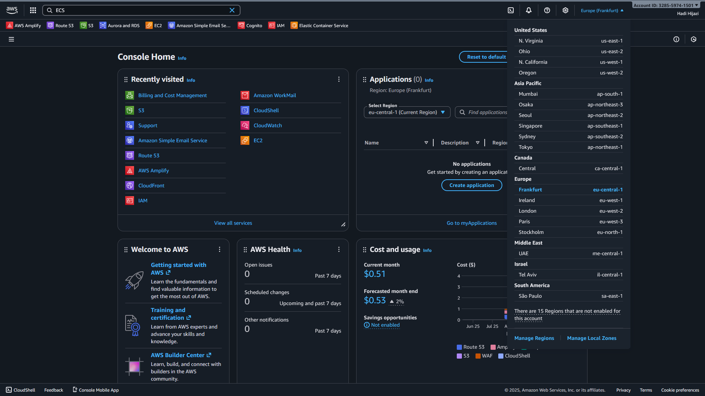
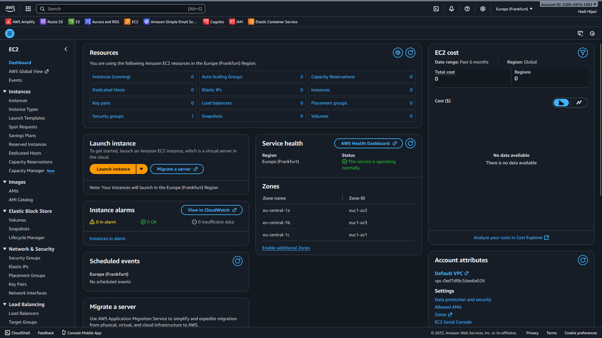
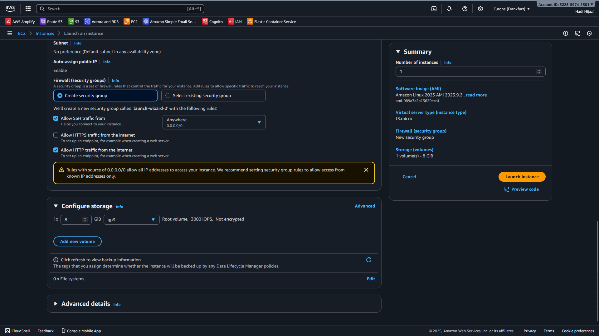
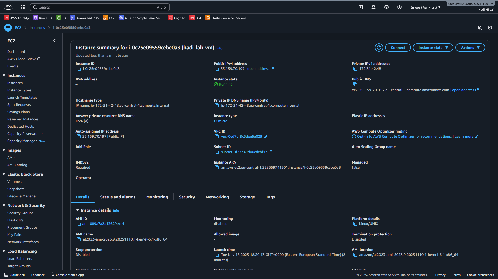
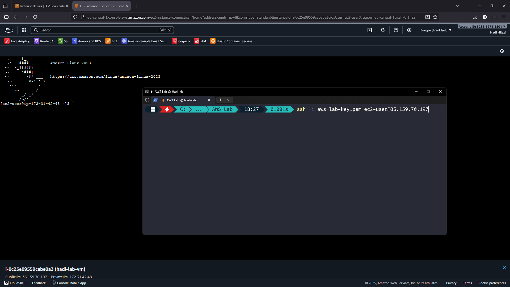
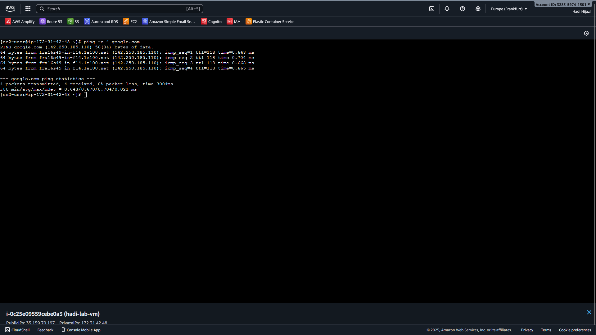
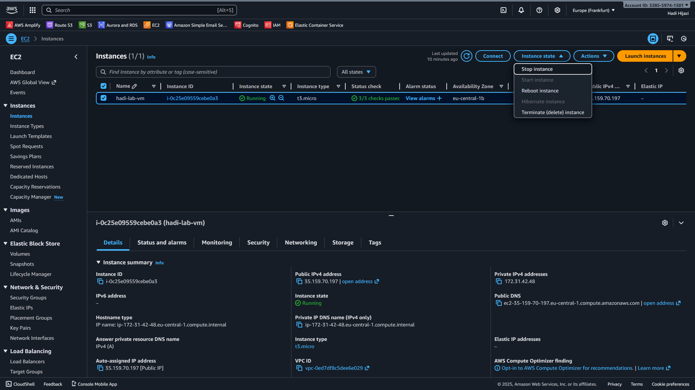
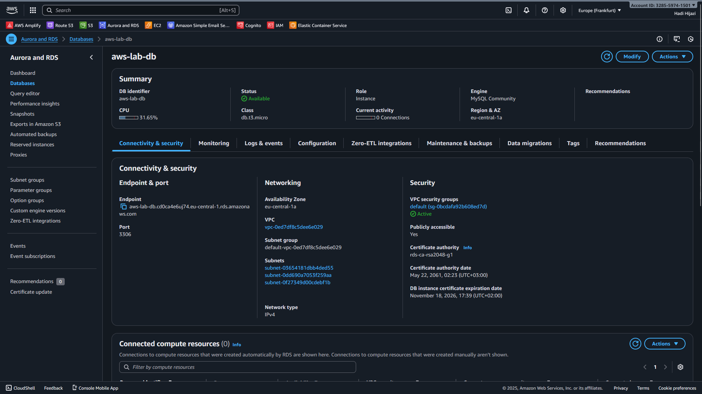
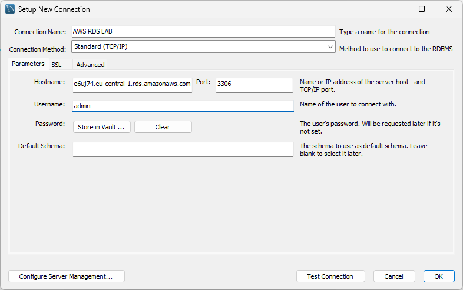

# Labwork: Using AWS RDS (MySQL) and EC2 (Linux)

After this labwork you will be able to:

* Understand AWS cloud computing services and Infrastructure as a Service (IaaS).
* Use the AWS Management Console.
* Create and use a **Linux virtual machine** using **Amazon EC2**.
* Create and manage a MySQL database using **Amazon RDS**.
* Deploy containerized applications using **Docker** on EC2.

<!--
> **Instructor note:** Add a simple overview diagram of the lab architecture here.
>
> <!-- illustration: high-level diagram showing "Student Laptop" ↔ "AWS EC2 (Linux VM)" ↔ "AWS RDS (MySQL)" -->

This lab is divided into three main parts:

1. **Part I - Linux Virtual Machine on Amazon EC2**
2. **Part II - MySQL Database on AWS RDS**
3. **Part III - Running Docker Containers on EC2** (advanced)

For each part you will follow instructions and answer some questions.

---

## Introduction to AWS and Cloud Computing

### What is Amazon Web Services (AWS)?

**Amazon Web Services (AWS)** is a comprehensive cloud computing platform provided by Amazon. It offers a wide range of cloud services including computing power, storage, databases, networking, analytics, machine learning, and more.

**Key characteristics of AWS:**

* **On-demand:** Resources are available when you need them
* **Pay-as-you-go:** You only pay for what you use
* **Scalable:** Easy to scale resources up or down
* **Global:** Data centers in multiple regions worldwide
* **Secure:** Enterprise-grade security and compliance

### Cloud Service Models

AWS provides different service models:

1. **Infrastructure as a Service (IaaS)** - Focus of this lab
   * Provides virtualized computing resources
   * You manage: OS, applications, data
   * AWS manages: Physical infrastructure, virtualization
   * Examples: **EC2**, **VPC**, **EBS**

2. **Platform as a Service (PaaS)**
   * Provides a platform for application development
   * You manage: Applications and data
   * AWS manages: Runtime, middleware, OS, infrastructure
   * Examples: **Elastic Beanstalk**, **Lambda**

3. **Software as a Service (SaaS)**
   * Complete applications managed by the provider
   * Examples: **Amazon WorkDocs**, **Amazon Chime**

### AWS Regions and Availability Zones

* **Region:** A geographical area containing multiple data centers (e.g., `eu-central-1` - Frankfurt, `us-east-1` - N. Virginia)
* **Availability Zone (AZ):** One or more discrete data centers within a Region
* Each Region has multiple AZs for high availability and fault tolerance

**Reference:** [AWS Global Infrastructure](https://aws.amazon.com/about-aws/global-infrastructure/)

---

## Part I - Linux Virtual Machine on Amazon EC2

### Overview of AWS Compute Services

AWS provides several computing services to run applications in the cloud:

| Service | Type | Description | Use Case |
|---------|------|-------------|----------|
| **Amazon EC2** | IaaS | Virtual servers in the cloud | Full control over OS and applications |
| **AWS Lambda** | Serverless | Run code without managing servers | Event-driven applications |
| **AWS Elastic Beanstalk** | PaaS | Deploy and scale web applications | Quick deployment without infrastructure management |
| **Amazon ECS/EKS** | Container | Run Docker containers | Microservices architecture |
| **Amazon Lightsail** | Simplified VPS | Easy-to-use virtual private servers | Simple web applications |

### What is Amazon EC2?

**Amazon Elastic Compute Cloud (EC2)** is a web service that provides secure, resizable compute capacity in the cloud. It is the core IaaS offering from AWS.

**Key Features of EC2:**

1. **Virtual Computing Environments (Instances)**
   * Choose from various instance types optimized for different workloads
   * Instance families: General Purpose (T3, M5), Compute Optimized (C5), Memory Optimized (R5), Storage Optimized (I3), GPU Instances (P3, G4)

2. **Flexible Configuration**
   * Choose CPU, memory, storage, and networking capacity
   * Select from multiple operating systems (Linux, Windows, etc.)
   * Configure security with Security Groups (virtual firewalls)

3. **Storage Options**
   * **Instance Store:** Temporary block-level storage
   * **Elastic Block Store (EBS):** Persistent block storage volumes
   * **Elastic File System (EFS):** Scalable file storage

4. **Networking Features**
   * **Virtual Private Cloud (VPC):** Isolated network environment
   * **Elastic IP:** Static public IP addresses
   * **Elastic Network Interfaces:** Virtual network cards
   * **Security Groups:** Control inbound and outbound traffic

5. **Scalability and High Availability**
   * **Auto Scaling:** Automatically adjust capacity
   * **Elastic Load Balancing:** Distribute traffic across instances
   * **Multiple Availability Zones:** Deploy across multiple data centers

6. **Purchasing Options**
   * **On-Demand:** Pay by the hour or second
   * **Reserved Instances:** Commit for 1-3 years for discounts
   * **Spot Instances:** Bid for unused capacity at lower prices
   * **Savings Plans:** Flexible pricing model

7. **Amazon Machine Images (AMI)**
   * Pre-configured templates containing OS and software
   * AWS provides official AMIs (Amazon Linux, Ubuntu, Windows, etc.)
   * You can create custom AMIs
   * Community and Marketplace AMIs available

8. **Instance Lifecycle**
   * **Launch:** Start a new instance
   * **Stop:** Shut down (you're charged for EBS storage only)
   * **Start:** Resume a stopped instance
   * **Reboot:** Restart the instance
   * **Terminate:** Permanently delete the instance

**Reference:** [Amazon EC2 Documentation](https://docs.aws.amazon.com/ec2/)

---

### 1. Open the AWS Management Console and EC2

1. Go to the AWS Management Console: [https://console.aws.amazon.com](https://console.aws.amazon.com)
2. Sign in with your AWS account.
3. At the top-right, make sure you select a region close to you (for example: `eu-central-1` or `eu-west-1`).

> 

1. In the search bar, type **EC2** and open the **EC2** service.

> 

---

### 2. Launch an EC2 Instance

1. In the EC2 dashboard, click **Instances** → **Launch instances**.

2. Fill in the launch form:

   * **Name and tags**: give your instance a name like `yourname-lab-vm`.

   * **Application and OS Images (AMI)**:

     * Choose a Linux image such as **Amazon Linux 2023** or **Ubuntu Server** (free-tier eligible).
     * AMIs are pre-configured templates that contain the operating system and optionally other software.

   * **Instance type**:

     * Choose a small, free-tier eligible instance, for example `t2.micro` or `t3.micro`.
     * Instance types determine the CPU, memory, storage, and networking capacity.
     * **t2.micro**: 1 vCPU, 1 GB RAM (free-tier eligible)
     * Different instance families serve different purposes (compute, memory, storage optimized).

   * **Key pair (login)**:

     * Create a new key pair if you don't have one.
     * Download the `.pem` (or `.ppk`) file and keep it safe. You will use it for SSH.
     * Key pairs provide secure SSH access to your instance.

   * **Network settings (firewall)**:

     * Use the default VPC and subnet.
     * Create or select a **security group** that allows **SSH (port 22)** from your IP.
     * Security groups act as virtual firewalls controlling inbound and outbound traffic.
     * **Best practice:** Restrict SSH access to your IP address only.

   * **Configure storage**:

     * Keep the default root volume size (e.g. 8-20 GB) unless instructed otherwise.
     * Choose **General Purpose SSD (gp3)** for the volume type.
     * You can add additional EBS volumes if needed.

> 

1. Review the summary and click **Launch instance**.

2. Go back to **Instances** and wait until the instance state becomes **Running** and the status checks show as **2/2 checks passed**.

> 

---

### 3. Explore the EC2 Instance Details

Select your running instance and look at the **details** panel below.

1. **Question 1:** What is the **Instance ID** of your VM?

2. **Question 2:** What is the **Public IPv4 address** (and/or **Public IPv4 DNS**) of your instance?

   * What is this public address used for?

3. **Question 3:** What are the available ways to connect to the instance, as shown in the console?
   (For example: **EC2 Instance Connect (browser-based)**, **SSH client**, or **Session Manager**.)

Write your answers in your report.

---

### 4. Connect to the Instance via SSH

You can connect using either the browser or your local terminal.

#### Option A - EC2 Instance Connect (Browser)

1. Select your instance.
2. Click the **Connect** button.
3. Choose the **EC2 Instance Connect** tab and click **Connect**.

A browser-based terminal will open.

#### Option B - SSH Client (Local Terminal)

1. Ensure your key pair file (e.g. `my-key.pem`) is on your machine and has correct permissions (Linux/macOS):

```bash
chmod 400 my-key.pem
```

1. Use an SSH command similar to:

```bash
ssh -i my-key.pem ec2-user@<your-public-ip>
```

* For **Amazon Linux**, the default username is often `ec2-user`.
* For **Ubuntu**, the default username is usually `ubuntu`.

Once connected, you will see a shell prompt on your remote Linux machine.

> 

---

### 5. Create Directories on the VM

On your EC2 instance terminal, run the following commands:

1. Go to your home directory (if not already there):

```bash
cd ~
```

1. Create three folders: `Desktop`, `Documents`, and `Downloads`:

```bash
mkdir Desktop
mkdir Documents
mkdir Downloads
```

1. List the contents of your home directory:

```bash
ls
```

**Question 4:** What do you see in the output of `ls`?
Describe the folders that exist in your home directory.

---

### 6. Test Network Connectivity (ping)

From your EC2 terminal, try to ping a website, for example:

```bash
ping -c 4 google.com
```

**Question 5:** What do you observe in the ping output?

* Are there replies?
* What kind of information is shown in each line (time, TTL, etc.)?

Write a short explanation.

> 

---

### 7. Stop or Terminate the Instance

When you finish your work, you should not leave instances running unnecessarily.

1. Go back to the **EC2** console.
2. Select your instance.
3. Click **Instance state** and choose either:

   * **Stop instance** - to shut it down but keep the attached storage (you can start it again later).
   * **Terminate instance** - to permanently delete the instance. If the root volume is set to delete on termination, local data on that volume will be lost.

> 

**Question 6:** What is the difference between **stopping** an instance and **terminating** it in EC2?

Write a brief explanation in your report.

---

## Part II - MySQL Database on AWS RDS

In this part you will learn how to create and manage a MySQL database using **Amazon RDS**.

### 1. Configuration Options - Questions

Once the DB creation wizard is shown (or after you create the DB, you can re-open it in **Modify** mode), you will see several configuration sections.

1. **Question 7:** When you expand the configuration sections while creating or modifying the database, what are the main groups of options (e.g. Connectivity, DB instance class, Storage, Backup, etc.)?

2. **Question 8:** Briefly explain the first three groups:

   * **Connectivity**
     → What does it control? Mention things like VPC, public access, and security groups.
   * **DB instance class and Storage**
     → What do these options control? Explain how instance class relates to CPU/RAM and storage to disk size/IOPS.
   * **Backups and High availability / Multi-AZ**
     → What is the purpose of automatic backups and Multi-AZ deployments?

Write your answers in your report.

---

### 2. Explore the RDS Database Dashboard

Once your instance is **Available**:

1. Click on **Databases** in the RDS menu.
2. Select the DB instance you just created.

You will see an overview page (dashboard) for that instance.

> 

Answer the following:

1. **Question 9:** What are the main sections/tabs shown on the DB instance details page?
   (Examples: **Connectivity & security**, **Configuration**, **Monitoring**, **Logs & events**, **Maintenance & backups**, etc.)

2. **Question 10:** What is the **Endpoint** and **Port** of your instance?

   * Who should know this information?
   * Why is it important to keep it reasonably private and secure?

3. Go to the **Connectivity & security** tab:

   * Look at the **Connectivity** section.

   **Question 11:** What are the steps required to allow a user to connect to your instance from their laptop?

   * Consider public access, security group rules (port 3306), and the client's IP address.

4. Go to the **Configuration** tab:

   **Question 12:** What information about the **master username**, **engine version**, and **DB instance class** can you see here? How is this information used during the connection process and performance planning?

5. Go to the **Maintenance & backups** (or similarly named) section:

   **Question 13:** Explain briefly:

   * What are **automated backups** and how long are they kept?
   * What are **manual snapshots**?
   * What is a **Multi-AZ deployment** or **read replica** in RDS?

Write your answers in your lab report.

---

### 3. Connect to the Database from MySQL Workbench

In this step, you will connect to the RDS instance from your local machine using **MySQL Workbench** (or another MySQL client).

1. Open **MySQL Workbench** on your computer.
2. Create a **new connection** and fill in:

   * **Hostname**: the **Endpoint** of your RDS instance (e.g. `your-db.xyz123.eu-central-1.rds.amazonaws.com`).
   * **Port**: `3306` (default MySQL port, unless you changed it).
   * **Username**: the master username you configured (e.g. `admin`).
   * **Password**: click **Store in keychain / vault** and enter the master password you created.

> 

1. Test the connection.

   * If it fails, check:

     * That the RDS instance status is **Available**.
     * That **Public access** is enabled.
     * That the security group attached to the RDS instance allows inbound traffic on port 3306 from your public IP.

2. Once the test passes, click **OK** to save and then double-click the connection to open it.

---

### 4. Create and Populate a Database

Inside MySQL Workbench, connected to your RDS instance:

1. Create a new database (schema) for this lab, for example:

```sql
CREATE DATABASE lab_example;
USE lab_example;
```

1. Create one or more tables of your choice (or use a database provided by your instructor). Example:

```sql
CREATE TABLE students (
    id INT AUTO_INCREMENT PRIMARY KEY,
    full_name VARCHAR(100) NOT NULL,
    email VARCHAR(100) UNIQUE,
    major VARCHAR(50),
    created_at TIMESTAMP DEFAULT CURRENT_TIMESTAMP
);

INSERT INTO students (full_name, email, major) VALUES
('Alice Smith', 'alice@example.com', 'Computer Science'),
('Bob Johnson', 'bob@example.com', 'Mathematics'),
('Charlie Brown', 'charlie@example.com', 'Physics');
```

1. Run a few **SELECT** queries to verify the content:

```sql
SELECT * FROM students;
SELECT full_name, major FROM students WHERE major = 'Computer Science';
```

---

### 5. Reconnect and Observe Persistence

1. Close **MySQL Workbench** completely.
2. Re-open it and reconnect to your RDS instance.
3. Run a **SELECT** query again on one of the tables you filled with data.

**Question 14:** What do you observe?

* Is your data still there?
* What does this tell you about how persistence works for an RDS database instance?

Write a short comment in your lab report.

---

## Part III - Running a Dockerized PHP Application on EC2

In this part you will create a simple PHP application that connects to your RDS MySQL database, dockerize it, and run it on your EC2 instance.

### 1. Prepare the PHP Application

You will create a small PHP script that:

* Connects to the RDS MySQL database you created in Part II.
* Fetches student records from the `students` table.
* Displays them in a web browser.

The application structure will be:

```
php-student-app/
├── index.php      # Main PHP script
└── Dockerfile     # Docker configuration
```

On your **local machine**, create a new directory for the application:

```bash
mkdir php-student-app
cd php-student-app
```

#### Create `index.php`

Create a file named `index.php` with the following content:

```php
<?php
<?php
// Database configuration
$host = "aws-lab-db.cd0ca4e6uj74.eu-central-1.rds.amazonaws.com";
$port = 3306;
$database = "labdb";
$username = "admin";
$password = "password";

// Connect to MySQL database
try {
    $conn = new PDO("mysql:host=$host;port=$port;dbname=$database", $username, $password);
    $conn->setAttribute(PDO::ATTR_ERRMODE, PDO::ERRMODE_EXCEPTION);
    
    // Query to fetch all students
    $stmt = $conn->query("SELECT * FROM students");
    $students = $stmt->fetchAll(PDO::FETCH_ASSOC);
    
} catch(PDOException $e) {
    die("Connection failed: " . $e->getMessage());
}
?>
<!DOCTYPE html>
<html>
<head>
    <title>Student List</title>
</head>
<body>
    <?php if (count($students) > 0): ?>
        <table>
            <tr>
                <th>ID</th>
                <th>Full Name</th>
                <th>Email</th>
                <th>Major</th>
                <th>Created At</th>
            </tr>
            <?php foreach ($students as $student): ?>
            <tr>
                <td><?php echo $student['id']; ?></td>
                <td><?php echo $student['full_name']; ?></td>
                <td><?php echo $student['email']; ?></td>
                <td><?php echo $student['major']; ?></td>
                <td><?php echo $student['created_at']; ?></td>
            </tr>
            <?php endforeach; ?>
        </table>
    <?php else: ?>
        <p>No students found in the database.</p>
    <?php endif; ?>
</body>
</html>

```

**Important:** Make sure to replace the hardcoded values (`host`, `database`, `username`, `password`) with your actual RDS endpoint and credentials before building the Docker image.

#### Create `Dockerfile`

Create a file named `Dockerfile`:

```dockerfile
FROM php:8.2-apache

# Install MySQL PDO extension
RUN docker-php-ext-install pdo pdo_mysql

# Enable Apache mod_rewrite (optional, for clean URLs)
RUN a2enmod rewrite

# Copy application files
COPY index.php /var/www/html/

# Set proper permissions
RUN chown -R www-data:www-data /var/www/html

# Expose port 80
EXPOSE 80
```

---

### 2. Build and Push Docker Image

Instead of building the image on EC2, you will build it locally and push it to **Docker Hub**, then pull it from EC2.

#### 2.1. Create a Docker Hub Account (if needed)

1. Go to [https://hub.docker.com](https://hub.docker.com) and create a free account.
2. Remember your Docker Hub username.

#### 2.2. Build and Push the Image Locally

On your **local machine**, in the `php-student-app` directory:

1. Log in to Docker Hub:

```bash
docker login
```

Enter your Docker Hub username and password.

1. Build the image with your Docker Hub username:

```bash
docker build -t your-dockerhub-username/php-student-app:latest .
```

*Replace `your-dockerhub-username` with your actual Docker Hub username.*

**Question 15:** What happens during the `docker build` process? List the main steps shown in the output.

1. Push the image to Docker Hub:

```bash
docker push your-dockerhub-username/php-student-app:latest
```

This will upload your image to Docker Hub so it can be accessed from anywhere.

**Question 16:** How long does it take to push the image? What is the approximate size of the image?

---

### 3. Deploy to EC2

Now you will pull and run the Docker image on your EC2 instance.

#### 3.1. Install Docker on EC2

Connect to your EC2 instance via SSH (as in Part I), then install Docker:

**For Amazon Linux 2023:**

```bash
sudo yum update -y
sudo yum install -y docker
sudo systemctl start docker
sudo systemctl enable docker
sudo usermod -a -G docker ec2-user
```

After adding your user to the docker group, **log out and log back in** for the changes to take effect, or run:

```bash
newgrp docker
```

Verify Docker is running:

```bash
docker --version
docker ps
```

**Question 17:** What version of Docker is installed on your EC2 instance?

#### 3.2. Configure Security Group

Your EC2 security group must allow inbound traffic on port **8080** (or port 80 if you prefer) from your IP address (or from anywhere, for testing).

1. Go to **EC2 Console** → **Instances** → select your instance.
2. Click on the **Security** tab.
3. Click on the security group link.
4. Click **Edit inbound rules** → **Add rule**:
   * **Type**: Custom TCP
   * **Port range**: 8080
   * **Source**: My IP (or 0.0.0.0/0 for testing)
5. Save the rules.

**Question 18:** Why is it important to configure the security group to allow traffic on port 8080?

#### 3.3. Pull and Run the Docker Container on EC2

On your EC2 instance:

1. Pull the image from Docker Hub:

```bash
docker pull your-dockerhub-username/php-student-app:latest
```

*Replace `your-dockerhub-username` with your Docker Hub username.*

**Question 19:** What happens when you pull the image? How does Docker know where to get it from?

1. Run the container:

```bash
docker run -d --name student-app -p 8080:80 your-dockerhub-username/php-student-app:latest
```

1. Verify the container is running:

```bash
docker ps
```

You should see your `student-app` container running.

---

### 4. Access the Application

Open your web browser and navigate to:

```
http://<your-ec2-public-ip>:8080
```

You should see the student list displayed in a table.

**Question 20:**

* Does the application successfully display the students from your RDS database?
* Take a screenshot of the browser showing the student list.

---

### 5. Architecture Overview

By completing this part, you have created a complete cloud architecture:

```
┌─────────────────┐
│   Your Laptop   │
│   (Browser)     │
└────────┬────────┘
         │ HTTP (port 8080)
         ▼
┌─────────────────────────────────┐
│   AWS EC2 Instance              │
│  ┌──────────────────────────┐   │
│  │  Docker Container        │   │
│  │  ┌────────────────────┐  │   │
│  │  │  Apache + PHP      │  │   │
│  │  │  (index.php)       │  │   │
│  │  └─────────┬──────────┘  │   │
│  └────────────┼─────────────┘   │
└───────────────┼─────────────────┘
                │ MySQL connection
                │ (port 3306)
                ▼
┌─────────────────────────────────┐
│   AWS RDS MySQL Database        │
│   (lab_example.students)        │
└─────────────────────────────────┘
```

**Question 21:** Describe the flow of data when a user accesses your application:

* What happens when you type the URL in your browser?
* How does the request reach your PHP application?
* How does the PHP application connect to the database?
* How is the response sent back to the browser?

**Question 22:** What are the advantages of using Docker Hub instead of building the image directly on EC2?

---

### 6. Cleanup

When you finish testing:

1. Stop and remove the Docker container on EC2:

```bash
docker stop student-app
docker rm student-app
```

1. Optionally, remove the Docker image:

```bash
docker rmi php-student-app
```

1. Stop or terminate your EC2 instance (see Part I, step 7).

2. Optionally, delete your RDS database instance if you no longer need it:
   * Go to RDS Console → Databases
   * Select your instance → Actions → Delete
   * Uncheck "Create final snapshot" if this is just a lab
   * Type the confirmation text and delete

**Question 23:** What are the cost implications of leaving EC2 instances and RDS databases running when not in use?

---

## Deliverables

Submit a report containing:

1. **Part I - EC2:**
   * Answers to Questions 1-6
   * Screenshots showing your EC2 instance details and terminal session

2. **Part II - RDS:**
   * Answers to Questions 7-14
   * Screenshots of your RDS dashboard and MySQL Workbench connection

3. **Part III - Docker on EC2:**
   * Answers to Questions 15-23
   * Screenshots of:
     * Docker build and push process
     * Docker pull on EC2
     * Running container (`docker ps`)
     * Application in browser showing student data
   * Brief reflection on what you learned about deploying containerized applications to the cloud

---

**End of Lab**
