# IN401- Network III

## Chapter 1- TCP

A Network is a set of devices connected together.

### Types of Networks

- **LAN** *(Local Area Network)*: A network that connects devices within a limited area such as a home, school, or office building.

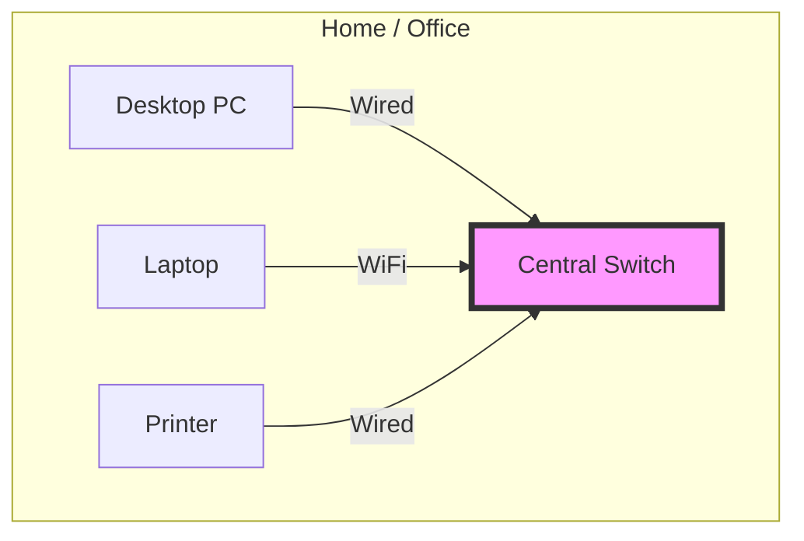

- **WAN** *(Wide Area Network)*: A network that covers a broad area (e.g., any network whose communications links cross metropolitan, regional, or national boundaries over a long distance).

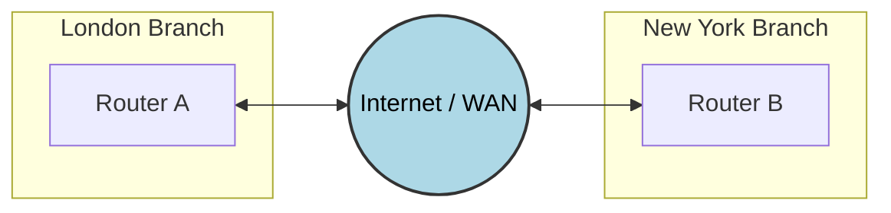

- **MAN** *(Metropolitan Area Network)*: A network that connects users in a geographic area or region larger than that covered by even a large local area network (LAN) but smaller than the area covered by a wide area network (WAN).

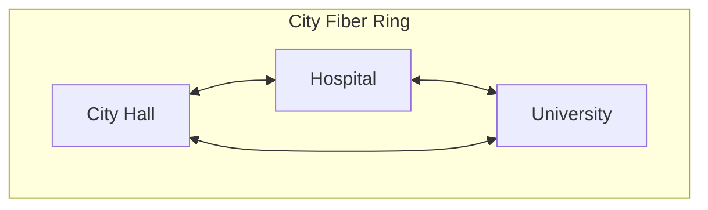

- **PAN** *(Personal Area Network)*: A network for interconnecting devices centered around an individual person's workspace.

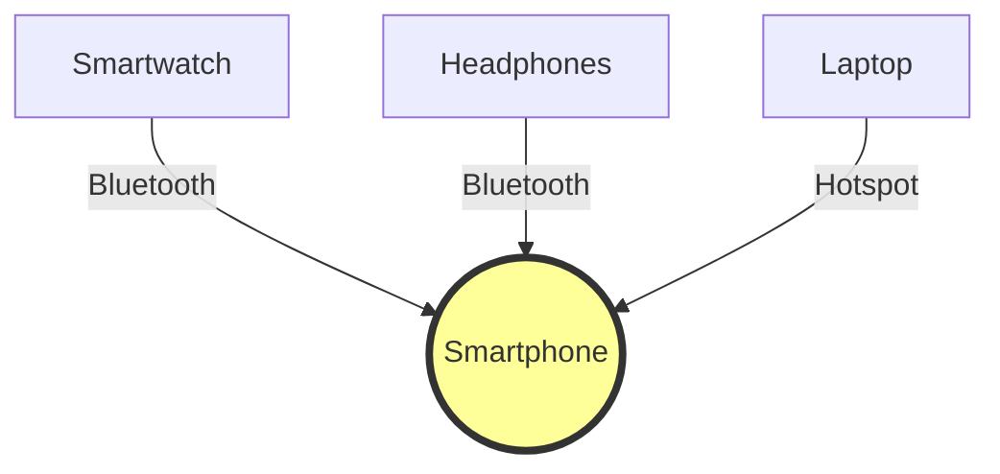

### Network Topologies

- **Star Topology**: All devices are connected to a central hub.

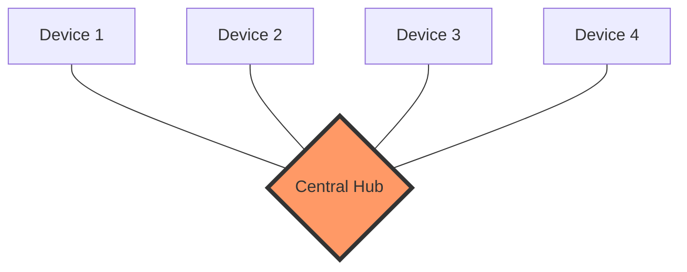

- **Bus Topology**: All devices are connected to a single central cable, called the bus or backbone.

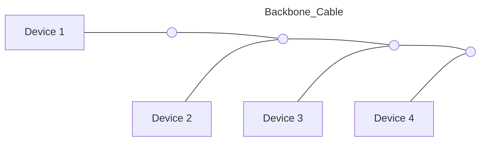

- **Ring Topology**: Each device is connected to two other devices, forming a circular data path.

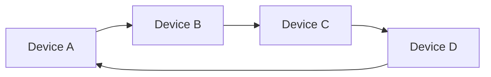

- **Mesh Topology**: Every device is connected to every other device in the network.

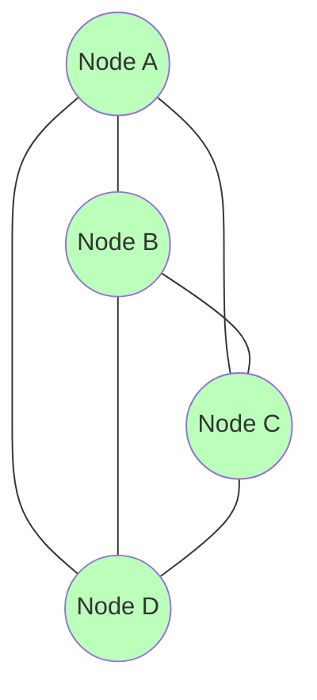

- **Hybrid Topology**: A combination of two or more different types of topologies.

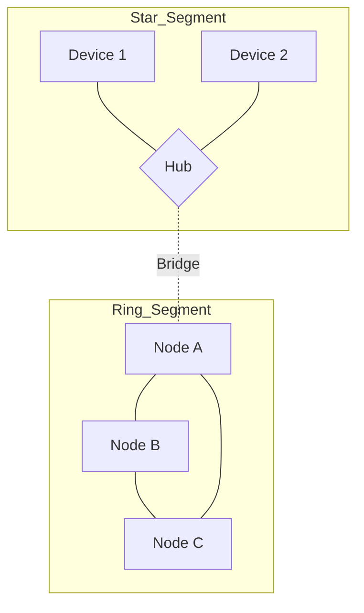

### Network Devices

- **Router**: A device that forwards data packets between computer networks, creating an overlay internetwork.
- **Switch**: A device that filters and forwards packets between LAN segments.
- **Hub**: A basic networking device that connects multiple Ethernet devices, making them act as a single network segment.
- **Modem**: A device that modulates and demodulates signals for data transmission over telephone lines.
- **Access Point**: A device that allows wireless devices to connect to a wired network using Wi-Fi or related standards.
- others...

### Network Layers

- **Physical Layer**: Deals with the physical connection between devices and the transmission of binary data over physical media.
- **Data Link Layer**: Responsible for node-to-node data transfer and error detection/correction.
- **Network Layer**: Manages device addressing, tracks the location of devices on the network, and determines the best way to move data.
- **Transport Layer**: Provides reliable data transfer services to the upper layers.
- **Session Layer**: Manages sessions between applications.
- **Presentation Layer**: Translates data between the application layer and the network format.
- **Application Layer**: Provides network services directly to end-user applications.

#### Models & Layers Comparison

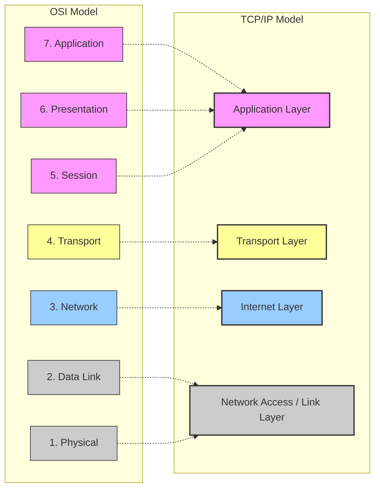

#### Encapsulation

Data encapsulation is the process of wrapping data with protocol information at each layer of the OSI or TCP/IP model.

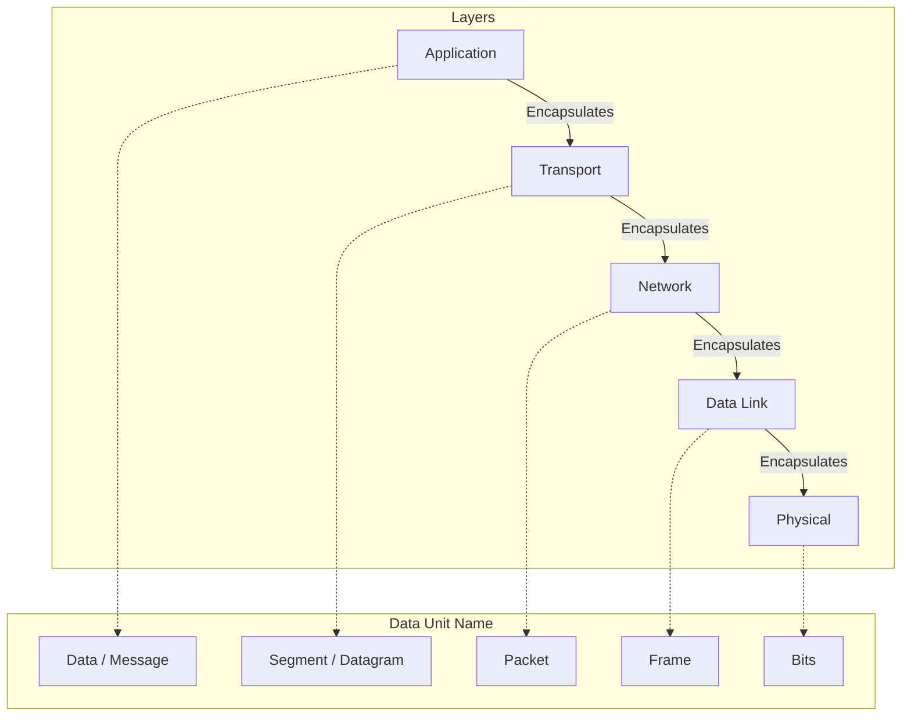

### Congestion Control

Congestion control ensures the sender does not overwhelm the network. It uses a **Congestion Window (cwnd)**.

#### TCP Phases

**Slow Start:** Exponential growth *(**CWND** doubles every **RTT**)*. Starts at 1 **MSS**.

**Congestion Avoidance:** Linear growth *(CWND + 1 MSS per RTT)*. Happens after reaching the threshold (ssthresh).

**Congestion Detection:**

- **Timeout:** Severe congestion (packet lost, no ACKs).
- **3 Duplicate ACKs:** Mild congestion (packet lost, but others arrived).

#### Visual Comparison: Tahoe vs. Reno

**TCP Tahoe** (The "Panic" Approach): On any loss (Timeout OR 3 Dup ACKs), it resets cwnd to 1 and enters Slow Start.

**TCP Reno** (The "Smart" Approach):

On **Timeout**: Resets cwnd to 1 (like Tahoe).

On **3 Dup ACKs (Fast Recovery)**: Halves the cwnd (cwnd = cwnd / 2) and enters **Congestion Avoidance** immediately. It skips Slow Start.

##### TCP Tahoe Graph (Always resets to 1)

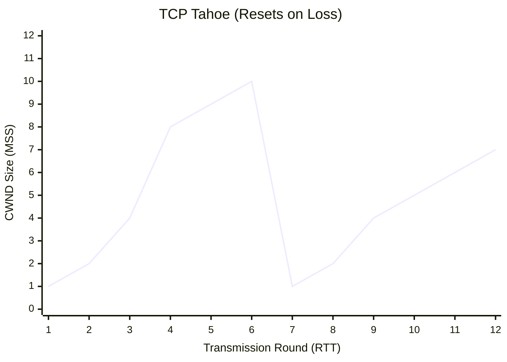

*Note: At Round 6, a loss occurs. Tahoe drops immediately to 1.*

##### TCP Reno Graph (Fast Recovery)

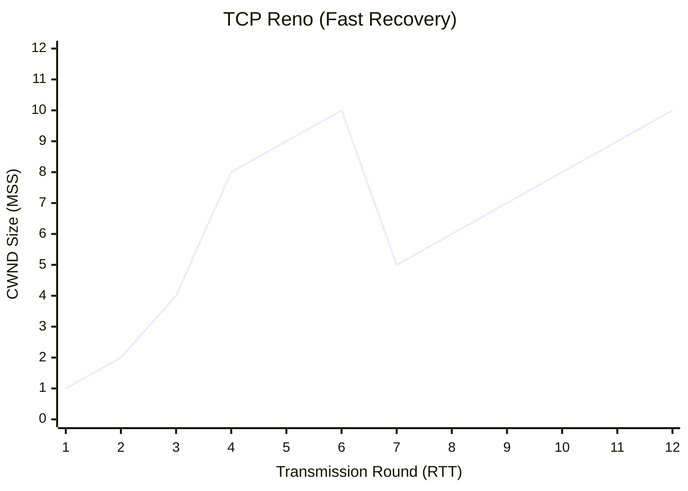

*Note: At Round 6, "3 Duplicate ACKs" occur. Reno cuts CWND in half (to 5) and grows linearly (Congestion Avoidance), avoiding the slow start restart.*

##### Key Differences

| Feature | TCP Tahoe | TCP Reno |
| :--- | :--- | :--- |
| **Response to Timeout** | Reset `cwnd` to 1 (Slow Start) | Reset `cwnd` to 1 (Slow Start) |
| **Response to 3 Dup ACKs** | Reset `cwnd` to 1 (Slow Start) | **Fast Recovery:** `cwnd` = `cwnd / 2`, then linear growth |
| **Philosophy** | Assumes all loss is severe congestion. | Distinguishes between severe loss (Timeout) and sporadic loss (Dup ACKs). |

### 3-Way Handshake

The TCP 3-way handshake is used to establish a reliable connection between a client and server.

1. **SYN**: The client sends a SYN (synchronize) packet to the server to initiate a connection.
2. **SYN-ACK**: The server responds with a SYN-ACK (synchronize-acknowledge) packet to acknowledge the client's request and synchronize its own sequence number.
3. **ACK**: The client sends an ACK (acknowledge) packet back to the server to confirm the connection is established.

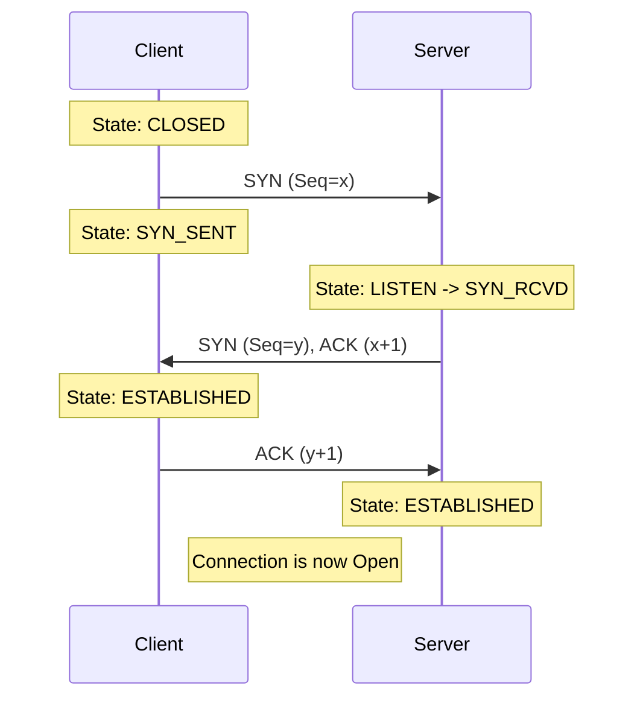

### RTT Estimation and Timeout Calculation

TCP uses **Round-Trip Time (RTT)** measurements to set retransmission timeouts adaptively.

#### The Formulas

- **EstimatedRTT:** Exponential Weighted Moving Average (EWMA) of sample RTTs.
  - Formula: `EstimatedRTT = (1 - α) × EstimatedRTT + α × SampleRTT`
  - Typical value: `α = 0.125` (weights recent samples more heavily)

- **DevRTT:** Deviation (variability) of RTT.
  - Formula: `DevRTT = (1 - β) × DevRTT + β × |SampleRTT - EstimatedRTT|`
  - Typical value: `β = 0.25`

- **TimeoutInterval:** The actual timeout value used.
  - Formula: `TimeoutInterval = EstimatedRTT + 4 × DevRTT`
  - The `4 × DevRTT` term provides a safety margin for variance.

#### TCP Timer Management

**Karn's Algorithm:** Do not use RTT samples from retransmitted segments (ambiguous which transmission the ACK corresponds to).

**Exponential Backoff:** When a timeout occurs:

- The timeout interval is **doubled** for the retransmission.
- Prevents further timeouts during congestion.
- Resets to calculated value once valid ACK is received.

*Example:* If timeout = 1s and packet is lost, next timeout = 2s, then 4s, then 8s, etc.

### Deep Dive: 3-Way Handshake Mechanics & Scenarios

#### How ACKs Work in the Header

An "ACK" isn't a separate packet type; it's just a segment with the **ACK Flag** set to `1` and a value in the **Acknowledgement Number** field.

- **Piggybacking:** The ACK for received data is often "piggybacked" onto an outgoing data segment to save bandwidth.
- **Cumulative:** The ACK number is always the **Next Expected Byte**. If you receive byte 100, you send `ACK = 101`.

#### Scenario A: The "Happy Path" (Normal Connection)

1. **Client:** Sends `SYN=1`, `Seq=x` (Random). No data allowed.
2. **Server:** Sends `SYN=1`, `ACK=1`.
    - `Seq=y` (Server's own random start).
    - `Ack=x+1` (Confirming client's SYN).
    - **Note:** The server must allocate memory (buffers) at this stage.
3. **Client:** Sends `ACK=1`.
    - `Seq=x+1`.
    - `Ack=y+1` (Confirming server's SYN).
    - **Note:** This 3rd packet *can* carry application data (e.g., the HTTP request).

#### Scenario B: The "Closed Door" (Connection Refused)

What happens if the Client sends a SYN to a port where no application is listening (e.g., port 8080 is closed)?

- **Server Response:** It does *not* ignore the packet. It replies with a **RST (Reset)** segment.
- **Meaning:** "No one is home. Stop trying." The client immediately aborts; no teardown is needed.

#### Scenario C: Packet Loss during Handshake

- **Lost SYN:** Client gets no response. It assumes the packet was lost and **retransmits the SYN** after a timeout.

- **Lost SYN-ACK:**
  - Client thinks its SYN was lost (retransmits SYN).
  - Server thinks its SYN-ACK was lost (retransmits SYN-ACK).
- **Lost Final ACK:**
  - Server remains in `SYN_RCVD` state.
  - Server eventually times out and retransmits the **SYN-ACK**.
  - *Edge Case:* If the client tries to send data immediately after the lost ACK, the server receives data for a connection it thinks isn't open yet. The server usually ignores the data until the handshake completes (or accepts it if the implementation allows "fast open").

#### Scenario D: Security & Random ISNs

Why use **Random** Initial Sequence Numbers (ISN) instead of starting at 0?

- **Prevention of "Old" Packet Confusion:** If a connection closes and immediately reopens, a stray packet from the *old* connection (delayed in the network) might arrive with `Seq=100`. If the new connection also started at 0 and is currently at 100, that old packet would be accepted as valid data, corrupting the file.
- **Anti-Spoofing / Hijacking:** If ISNs were predictable (e.g., always 0), an attacker could easily spoof a connection by guessing the sequence numbers. Randomness makes this much harder.

#### Scenario E: SYN Flood Attack (Denial of Service)

- **Attack:** Attacker sends thousands of `SYN` packets with fake (spoofed) IP addresses.

- **Result:** Server replies with `SYN-ACK` and allocates memory (buffers) for every request, waiting for the final `ACK` that never comes.
- **Impact:** Server runs out of memory/resources and crashes or stops accepting legitimate connections.
- **Defense:** **SYN Cookies** (Server doesn't allocate memory immediately; instead, it encodes the state into the Initial Sequence Number itself).

---

## Chapter 2- Quality of Service (QoS)

### The Need for QoS

IP networks are traditionally "Best Effort" (no guarantees). QoS is essential to manage limited resources and ensure performance for critical applications (Voice, Video) by managing four key metrics:

- **Bandwidth:** The capacity of the link. Lack of bandwidth causes congestion.
- **Packet Loss:** Occurs when buffers overflow.
- *Impact:* Video pixelization, choppy audio, retransmissions (TCP).

- **Latency (Delay):** Time taken from source to destination.
- *Real-time Requirement:* ITU recommends **< 150 ms** for voice/video.
- *Types:* Propagation (distance), Serialization (link speed), Processing (router CPU), Queuing (congestion).

- **Jitter (Delay Variation):** The difference in delay between consecutive packets.
- *Solution:* Jitter buffers (but these add delay).

### QoS Models: IntServ vs. DiffServ

There are three main models for handling traffic: **Best Effort**, **IntServ**, and **DiffServ**.

| Feature | IntServ (Integrated Services) | DiffServ (Differentiated Services) |
| --- | --- | --- |
| **Philosophy** | **Reservation** (Hard QoS). Signals the network to reserve bandwidth per flow. | **Categorization** (Soft QoS). Classifies packets into groups and treats groups differently. |
| **Scalability** | **Low**. Core routers must maintain state for *every* flow. Good for small networks. | **High**. Core routers only look at the class (DSCP mark), not individual flows. |
| **Protocol** | Uses **RSVP** (Resource ReSerVation Protocol). | Uses **DSCP** (Differentiated Services Code Point). |
| **Analogy** | Reserving a specific seat on a train. | Buying a "First Class" ticket (guarantees a type of seat, not a specific one). |

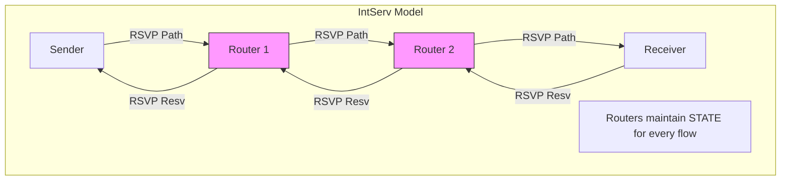

### IntServ Components

- **RSVP:** The signaling protocol.
- **PATH Message:** Sender  Receiver (Carries **TSpec**: Traffic Specification).
- **RESV Message:** Receiver  Sender (Carries **RSpec**: Reservation Specification).
- **Services:**
- **Guaranteed Service:** Hard bound on delay (for real-time apps).
- **Controlled Load:** Emulates a lightly loaded network (best effort but "better").

### Classification & Marking (DiffServ)

Packets are marked at the **Edge** so Core routers know how to treat them.

#### L3 Marking: DSCP (Differentiated Services Code Point)

Uses the 6-bit **ToS** field in the IP Header.

- **PHB (Per-Hop Behavior):** The treatment a packet gets based on its mark.
- **EF (Expedited Forwarding):** Low latency, low jitter, guaranteed bandwidth (e.g., **Voice**).
- **AF (Assured Forwarding):** 4 Classes, 3 Drop Probabilities.
- Formula: `AFxy` where `x` = Class (Priority) and `y` = Drop Probability (High y = High drop chance).
- *Example:* **AF41** is better than **AF11** (Higher Priority). **AF13** is dropped before **AF11** (Higher Drop Prob).

- **CS (Class Selector):** Backward compatible with old IP Precedence.

### Traffic Management Mechanisms

#### Policing vs. Shaping

Both control traffic rates, but they handle "excess" traffic differently.

- **Policing:** Drops excess packets (Strict). "Speed limit enforcement".
- **Shaping:** Buffers (delays) excess packets (Smooth). "Stoplight metering".

#### The Token Bucket Algorithm

Used for Policing/Shaping.

- **Bucket Size (b):** Represents maximum **Burst Size**.
- **Token Rate (r):** Represents **Average Rate**.
- **Math:** In a time interval `t`, the max data allowed is:

- *Concept:* Tokens fill the bucket at rate `r`. To send a packet, you need a token. If the bucket is full, tokens overflow (waste). If the bucket is empty, you wait (shape) or drop (police).

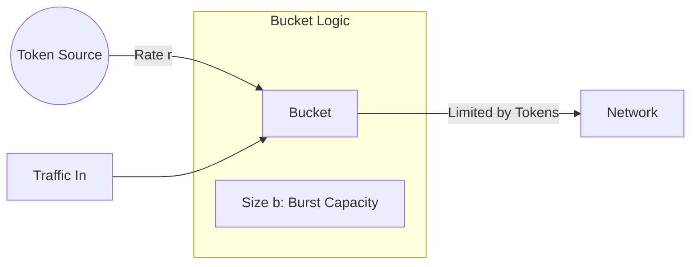

#### Congestion Management (Queuing)

How to handle packets when the buffer is full.

1. **FIFO:** First In, First Out. No QoS.
2. **PQ (Priority Queuing):** Strict priority. High priority always goes first. *Risk:* Starvation of lower queues.
3. **WFQ (Weighted Fair Queuing):** Fair sharing. Each flow gets a % of bandwidth.
4. **CBWFQ / LLQ:** The modern standard. Mixes strict priority (for Voice) with fair sharing (for Data).

### Congestion Avoidance

- **Tail Drop:** The default. When the queue is full, drop new packets. *Bad:* Causes "TCP Global Synchronization" (all streams slow down at once).
- **RED (Random Early Detection):** Randomly drops packets *before* the queue is full to signal TCP to slow down gracefully.

---

## Chapter 6- IPsec (IP Security)

### Overview

**IPsec** is a framework of **protocols and algorithms** to provide security for IP packets at the network layer (Layer 3).

- **Goal:** Protect data traveling across **untrusted networks** (e.g., the Internet).
- **Use Cases:** VPNs, secure site-to-site links, remote access.

### Security Services Provided

| Service | Description |
| --- | --- |
| **Confidentiality** | Encrypts payload so eavesdroppers cannot read it |
| **Data Integrity** | Ensures data has not been modified in transit |
| **Authentication** | Verifies the identity of the sender |
| **Anti-Replay** | Prevents attackers from capturing and re-sending packets |

### IPsec Protocols: AH vs. ESP

#### AH (Authentication Header)

- **Purpose:** Provides **Authentication** and **Integrity** (but **NO encryption**).
- **Protection:** Covers the entire IP packet including the header.
- **Use Case:** When you need to verify sender identity and ensure data hasn't been tampered with, but confidentiality is not required.
- **Limitation:** Not commonly used today because it doesn't encrypt data.

#### ESP (Encapsulating Security Payload)

- **Purpose:** Provides **Confidentiality**, **Authentication**, **Integrity**, and **Anti-Replay**.
- **Protection:** Encrypts the payload (and optionally authenticates the header).
- **Use Case:** The **preferred** choice for most VPN implementations.
- **Advantage:** Offers a complete security solution.

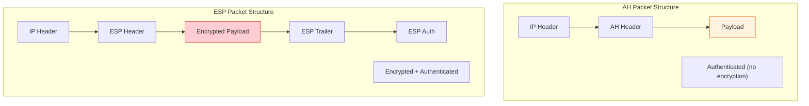

| Feature | AH | ESP |
| --- | --- | --- |
| **Confidentiality (Encryption)** | ❌ No | ✅ Yes |
| **Authentication** | ✅ Yes | ✅ Yes |
| **Integrity** | ✅ Yes | ✅ Yes |
| **Anti-Replay** | ✅ Yes | ✅ Yes |
| **Header Protection** | ✅ Yes (entire packet) | ⚠️ Partial (payload only) |
| **Common Usage** | Rare | ✅ Standard |

### IPsec Modes: Transport vs. Tunnel

#### Transport Mode

- **What's Protected:** Only the **payload** (data) is encrypted/authenticated.
- **IP Header:** The **original IP header** remains visible.
- **Use Case:** **Host-to-Host** communication (e.g., securing traffic between two servers).
- **Advantage:** Lower overhead (no extra IP header).

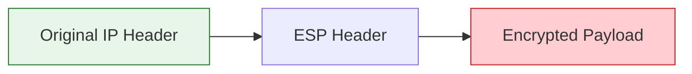

#### Tunnel Mode

- **What's Protected:** The **entire original IP packet** (header + payload) is encrypted.
- **New IP Header:** A **new outer IP header** is added to route the packet.
- **Use Case:** **Site-to-Site VPNs** or **Remote Access VPNs** (e.g., connecting branch offices).
- **Advantage:** Hides the original source/destination addresses.

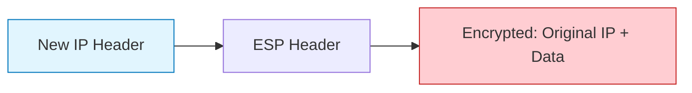

| Aspect | Transport Mode | Tunnel Mode |
| --- | --- | --- |
| **Encrypts** | Payload only | Entire original packet |
| **IP Header** | Original header visible | New outer header added |
| **Overhead** | Lower | Higher |
| **Use Case** | Host-to-Host | Site-to-Site VPN, Gateway-to-Gateway |
| **Hides Topology** | ❌ No | ✅ Yes |

### IKE/ISAKMP: The Key Exchange Protocol

**IKE (Internet Key Exchange)** is the protocol used to **establish Security Associations (SAs)** and negotiate encryption keys.

- **ISAKMP (Internet Security Association and Key Management Protocol):** The framework that defines the procedures for authentication and key exchange.
- **Two Phases:**

#### Phase 1: Establish a Secure Channel

- **Goal:** Authenticate the peers and create a secure, encrypted tunnel for Phase 2 negotiation.
- **Modes:**
  - **Main Mode:** 6 messages (more secure, slower).
  - **Aggressive Mode:** 3 messages (faster, less secure).
- **Output:** **ISAKMP SA** (a secure tunnel for management traffic).

#### Phase 2: Negotiate IPsec SAs

- **Goal:** Negotiate the actual **IPsec parameters** (encryption algorithm, lifetime, keys) for data traffic.
- **Mode:** **Quick Mode** (3 messages).
- **Output:** **IPsec SA** (used to encrypt/decrypt actual data packets).

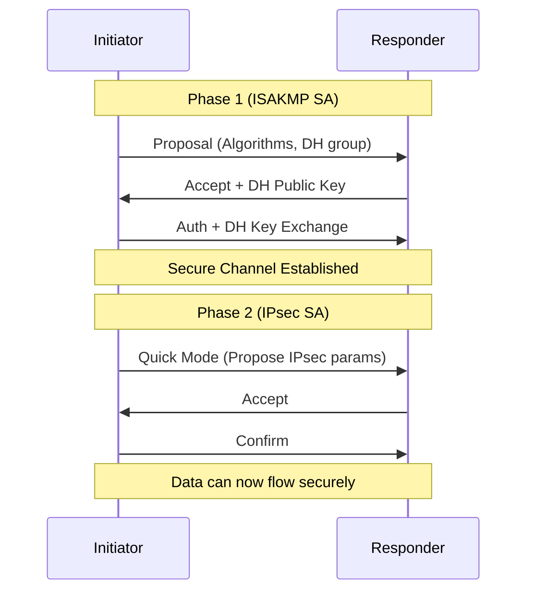

#### Security Association (SA)

An **SA** is a one-way relationship containing:

- **SPI (Security Parameter Index):** Unique identifier for the SA.
- **Destination IP Address.**
- **Security Protocol:** AH or ESP.
- **Encryption/Auth Algorithms.**
- **Keys.**
- **Lifetime:** How long before renegotiation.

*Note:* IPsec requires **two SAs** for bidirectional communication (one for each direction).

### IPsec in Action: VPN Example

**Scenario:** Company HQ (Site A) wants to securely connect to Branch Office (Site B).

1. **Phase 1:** Routers at both sites authenticate each other using IKE and establish a secure management channel.
2. **Phase 2:** Routers negotiate IPsec SAs (encryption keys, algorithms).
3. **Tunnel Mode ESP:** All traffic between sites is encrypted at the router level.
4. **Result:** Employees at Site B can access resources at HQ as if on the same LAN.

```mermaid
graph LR
    subgraph Site_A ["Site A (HQ)"]
        RouterA[VPN Router A]
    end
    
    Internet((Internet))
    
    subgraph Site_B ["Site B (Branch)"]
        RouterB[VPN Router B]
    end
    
    RouterA <-- IPsec Tunnel (ESP) --> Internet
    Internet <-- IPsec Tunnel (ESP) --> RouterB
    
    style Internet fill:#ffcdd2,stroke:#c62828
    Note["Traffic inside tunnel is encrypted"]
```

---

## IPv6

- **Why IPv6?** Developed because **IPv4 addresses are running out**. With the rise of IoT and internet-connected devices, the 32-bit space of IPv4 is insufficient. IPv6 solves this with a massive **128-bit address space**.

- **Addressing Format:**
  - Written in **Hexadecimal** (0-9, A-F).
  - Format: `x:x:x:x:x:x:x:x` (8 groups of 4 hex digits).

- **Notation Rules:**
  1. **Omit Leading Zeros:** `01ab` → `1ab`.
  2. **Double Colon (`::`):** Replaces *one* contiguous string of all-zero segments (e.g., `1:0:0:0:1` → `1::1`). Can only be used **once**.

- **Address Types:**
  - **Unicast:** One-to-One.
  - **Multicast:** One-to-Many.
  - **Anycast:** One-to-Nearest (assigned to multiple devices; routed to the closest one).
  - *Note:* There is **NO Broadcast** in IPv6 (Multicast is used instead).

- **Key Features:**
  - **Simpler Header:** Fixed 40 bytes (vs. IPv4's variable 20+ bytes) for faster processing.
  - **Autoconfiguration:** Supports SLAAC (Stateless) and DHCPv6 (Stateful).
  - **Security:** Built-in IPSec support.
  - **Flow Label & Traffic Class:** Support for QoS and flow identification.

### IPv6 Header: Flow Label & Traffic Class

The IPv6 header includes two fields specifically designed for **Quality of Service (QoS)** support:

#### Traffic Class (8 bits)

- **Purpose:** Similar to the **DSCP** field in IPv4.
- **Function:** Allows routers to classify and prioritize packets.
- **Usage:** Can mark packets for differentiated services (e.g., Voice = High Priority, Bulk Data = Low Priority).
- **Compatibility:** Works with **DiffServ** (Differentiated Services).

#### Flow Label (20 bits)

- **Purpose:** Identifies packets belonging to the **same flow** (stream of packets from source to destination requiring special handling).
- **Function:** Allows routers to provide **consistent treatment** for all packets in a flow without examining upper-layer headers.
- **Benefits:**
  - **Faster Processing:** Routers can make forwarding decisions based on the Flow Label alone.
  - **QoS Support:** Works with **IntServ/RSVP** to reserve resources for specific flows.
  - **Load Balancing:** Can be used for **Equal-Cost Multi-Path (ECMP)** routing decisions.

*Example:* A video streaming session can have all its packets tagged with the same Flow Label, ensuring they all receive the same low-latency treatment.

```mermaid
graph TD
    subgraph IPv6_Header ["IPv6 Header (40 Bytes Fixed)"]
        Version[Version: 6]
        TC[Traffic Class: 8 bits]
        FL[Flow Label: 20 bits]
        PayloadLen[Payload Length]
        NextHeader[Next Header]
        HopLimit[Hop Limit]
        SrcAddr[Source Address: 128 bits]
        DstAddr[Destination Address: 128 bits]
    end
    
    TC -.-> QoS1["Used for DiffServ (Packet Priority)"]
    FL -.-> QoS2["Used for Flow Identification (RSVP/IntServ)"]
    
    style TC fill:#fff3e0,stroke:#ef6c00
    style FL fill:#e1f5fe,stroke:#0277bd
```

#### Flow Label Usage Scenarios

| Scenario | How Flow Label Helps |
| --- | --- |
| **Real-Time Streaming** | All packets in a video call share the same Flow Label → routers apply consistent low-latency treatment |
| **ECMP Load Balancing** | Routers use Flow Label to hash and distribute flows across multiple equal-cost paths (keeps packets in same flow on same path) |
| **Resource Reservation (RSVP)** | Flow Label identifies the flow for which bandwidth has been reserved |
| **Firewall Optimization** | Firewalls can make decisions based on Flow Label without deep packet inspection |

**Note:** The combination of **Traffic Class** (DiffServ marking) and **Flow Label** (flow identification) makes IPv6 inherently more **QoS-friendly** than IPv4.

### IPv6 Address Anatomy & Compression

```mermaid
graph TD
    subgraph IPv6_Address ["IPv6 Address Structure (128 Bits)"]
        direction LR
        Raw["2001 : 0db8 : 0000 : 0000 : 0000 : 0000 : 1428 : 57ab"]
        Compressed["2001 : db8 :: 1428 : 57ab"]
        
        Raw -->|Rule 1: Remove Leading Zeros| Step1["2001 : db8 : 0 : 0 : 0 : 0 : 1428 : 57ab"]
        Step1 -->|Rule 2: Replace Zero Groups with '::'| Compressed
    end

    subgraph Types [Address Types]
        U(Unicast) -->|1-to-1| HostA[Host]
        M(Multicast) -->|1-to-Many| Group[Group of Hosts]
        A(Anycast) -->|1-to-Nearest| Nearest[Nearest Server]
    end
    
    style IPv6_Address fill:#e1f5fe,stroke:#01579b
    style Types fill:#fff9c4,stroke:#fbc02d

```

---

## Chapter 3- Network Function Virtualization (NFV)

### 1. The Concept

**NFV** replaces dedicated hardware appliances (proprietary "middleboxes") with software-based **Virtual Network Functions (VNFs)** running on standard commodity servers (COTS - Commercial Off-The-Shelf).

- **Traditional:** One physical node per role (Router, Firewall, DPI). Hard to scale, expensive.
- **Virtualized:** Generic hardware runs multiple functions as software. Flexible, scalable.

### 2. Benefits (Why do it?)

- **Cost Reduction:** Lowers **CAPEX** (less hardware to buy) and **OPEX** (less power/space/maintenance).

- **Agility:** Rapid deployment of new services (just software installation).
- **Scalability:** Elasticity (scale up/down on demand).
- **Vendor Independence:** Decouples software from hardware (avoids vendor lock-in).

### 3. ETSI NFV Architecture (The Standard)

The framework defined by ETSI has three main blocks:

1. **NFVI (NFV Infrastructure):** The foundation.
    - **Hardware:** Compute (CPU), Storage, Network.
    - **Virtualization Layer:** Hypervisor that abstracts hardware for the VNFs.
2. **VNFs (Virtualized Network Functions):** The software applications.
    - Examples: vRouter, vFirewall, vLoadBalancer.
3. **MANO (Management and Orchestration):** The "Brain".
    - **NFV Orchestrator (NFVO):** Manages the lifecycle of *Network Services* (chains of VNFs). Global view.
    - **VNF Manager (VNFM):** Manages the lifecycle of *individual* VNFs (start, stop, scale).
    - **VIM (Virtualized Infrastructure Manager):** Controls the hardware/resources (e.g., OpenStack).

```mermaid
graph TD
    %% --- Top Layer: OSS/BSS ---
    subgraph OSS ["OSS/BSS (Business Support)"]
        direction TB
        Billing[Billing & Service Management]
    end

    %% --- Main Block: VNF and NFVI ---
    subgraph Main_Stack [Network Service]
        direction TB
        
        %% VNF Layer
        subgraph VNFs [VNF Layer]
            VNF1[VNF: FireWall]
            VNF2[VNF: Router]
            EM[Element Manager]
        end

        %% NFVI Layer
        subgraph NFVI [NFV Infrastructure]
            subgraph Virtualization [Virtualization Layer]
                Hypervisor[Hypervisor / Container Engine]
            end
            
            subgraph Hardware [Hardware Resources]
                Compute[Compute] --- Storage[Storage] --- Net[Network]
            end
        end
    end

    %% --- Right Column: MANO ---
    subgraph MANO ["NFV MANO (Management & Orchestration)"]
        direction TB
        Orchestrator[NFV Orchestrator]
        VNFM[VNF Manager]
        VIM["VIM (Virtual Infra Manager)"]
    end

    %% --- Alignments and Connections ---
    Billing -.-> Orchestrator
    
    Orchestrator --> VNFM
    Orchestrator --> VIM
    
    VNFM -.-> VNF1 & VNF2 
    VNFM -.-> EM
    
    VIM -.-> Hypervisor
    VIM -.-> Hardware

    %% Styling to match the "Block" look
    style OSS fill:#e1f5fe,stroke:#01579b
    style MANO fill:#f3e5f5,stroke:#4a148c,stroke-width:2px
    style VNFs fill:#fff3e0,stroke:#e65100
    style NFVI fill:#e8f5e9,stroke:#1b5e20
    style Virtualization fill:#c8e6c9,stroke:none
    style Hardware fill:#a5d6a7,stroke:none
```

Another View:

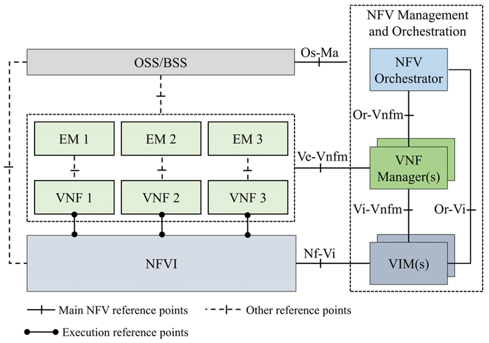

#### Component Breakdown

- **NFVI (NFV Infrastructure):** The foundation that hosts the virtual machines.
  - *Hardware Resources:* The physical Compute (CPU), Storage, and Network [switches].
  - *Virtualization Layer:* The Hypervisor (like KVM or ESXi) or Container Engine (like Docker) that abstracts the hardware, allowing multiple VMs to share the same physical server.

- **VNF (Virtualized Network Function):** The software application that performs the network function.
  - *Examples:* vRouter, vFirewall, vLoadBalancer.
  - *Element Manager (EM):* A small management agent specifically for the VNF [handles configuration and alarms for that specific app].

- **MANO (Management and Orchestration):** The "brain of the operation," responsible for managing the lifecycle of resources and services. It has three sub-components:
  - **NFV Orchestrator (NFVO):** The "Boss." It manages *Network Services* (chains of VNFs). It speaks to the OSS/BSS and decides when to create a new service.
  - **VNF Manager (VNFM):** The "Supervisor." It manages the lifecycle of *individual VNFs* (instantiating, scaling, updating, and terminating them).
  - **VIM (Virtualized Infrastructure Manager):** The "Resource Controller." It controls the NFVI (hardware/hypervisor). It allocates CPU, memory, and storage to the VMs. (*Common example: OpenStack*).

- **OSS/BSS (Operations/Business Support Systems):** The external business layer.
  - Handles billing, customer orders, and high-level service monitoring.
  - It sends requests to the Orchestrator (e.g., "Customer A bought a firewall service, please set it up").

### 4. Key Components of MANO

- **Instantiation:** Creating and launching VNFs from a blueprint.
- **Scaling:** Auto-scaling services out (adding more instances) based on traffic.
- **Healing:** Restarting failed VNFs or moving them to healthy servers.

### 5. Use Cases

- **5G Core:** Running 5G functions (UPF, SMF) as software.
- **vCPE (Virtual Customer Premise Equipment):** Replacing the box in your house/office with a virtual one in the cloud.
- **IoT:** Dynamic resource management for billions of devices.

## Chapter 4: Software Defined Networking (SDN)

### 1. Introduction: The Paradigm Shift

**SDN** decouples the **Control Plane** (decision making) from the **Data Plane** (packet forwarding).

- **Core Concept:** "Software Defined" = **Programmable**. SDN exposes the control of the underlying system to upper-layer developers through an API.

#### Traditional Router Architecture

**Monolithic & Proprietary:**

- Tightly coupled data and control planes in a single device.
- Runs proprietary implementations of standard protocols (IP, OSPF, BGP) in proprietary OS (e.g., Cisco IOS).
- Control is **distributed** on a per-router basis.

**Router Components:**

- **Input Ports:** Line termination, data link protocols (Ethernet), lookup/forwarding (decentralized switching).
- **Switching Fabric:** Transfers packets from input to output buffers. Types: Memory, Bus, Crossbar.
- **Output Ports:** Buffers packets, scheduling disciplines to choose next packet for transmission.

**Traditional Forwarding:**

- **Destination-Based:** Forwarding based solely on destination IP address.
- **Longest Prefix Matching:** Finds the routing table entry matching the longest address prefix.

#### Why SDN?

- **Innovation:** Programmability promotes innovation in data centers, wireless, security.
- **Simplification:** Unified mechanism to manage "middleboxes" (firewalls, load balancers).
- **Industry Evolution:** Move from vertically integrated, proprietary systems to horizontal, open-interface model (like PC industry vs. mainframes).

#### Traditional vs. SDN

| Feature | Traditional Network | SDN |
| --- | --- | --- |
| **Control** | Distributed (per-router) | Centralized (controller) |
| **Hardware** | Proprietary, vendor-locked | Commodity "white box" switches |
| **Programmability** | Limited (CLI configs) | Full (APIs, apps) |
| **Innovation** | Slow (vendor cycles) | Rapid (software updates) |

### 2. SDN Architecture (The 3 Layers)

```mermaid
graph TD
    %% Layers
    subgraph App_Layer ["Application Layer (Network Apps)"]
        FW[Firewall App]
        LB[Load Balancer App]
        Route[Routing App]
    end

    subgraph Control_Layer [Control Layer]
        NB_API((Northbound API <br/> REST))
        Controller[SDN Controller <br/> e.g., ONOS, OpenDaylight]
        SB_API((Southbound API <br/> OpenFlow))
    end

    subgraph Infra_Layer ["Infrastructure Layer (Data Plane)"]
        S1[Switch 1]
        S2[Switch 2]
        S3[Switch 3]
    end

    %% Connections
    FW & LB & Route --> NB_API
    NB_API --> Controller
    Controller --> SB_API
    SB_API --> S1 & S2 & S3
    
    %% Styling
    style App_Layer fill:#e1f5fe,stroke:#0277bd
    style Control_Layer fill:#fff3e0,stroke:#ef6c00
    style Infra_Layer fill:#e8f5e9,stroke:#2e7d32

```

### 3. The Data Plane: Generalized Forwarding

**Key Functions:**

- **Forwarding:** Moving packets from router's input to appropriate output (Data Plane).
- **Routing:** Determining end-to-end path from source to destination (Control Plane).

Switches use **Flow Tables** (Match + Action) instead of simple routing tables.

- **Protocol:** **OpenFlow** is the first and most widely adopted southbound API for SDN.

#### Flow Table Entry Structure

Each entry consists of:

1. **Pattern (Match):** Header fields to match (MAC, IP, TCP/UDP ports, VLAN, etc.).
2. **Actions:** What to do with matching packets (forward, drop, modify).
3. **Priority:** Used when multiple patterns match.
4. **Counters:** Statistics (bytes, packets matched).

#### Match-Plus-Action: Unifying Device Behavior

This abOpenFlow Protocol Details

**OpenFlow** is the standard southbound API for SDN communication between controller and switches.

#### Message Types

**Controller-to-Switch:**

- **Features Request:** Query switch capabilities.
- **Configuration:** Set switch parameters.
- **Flow Mod (Modify):** Add/delete/modify flow table entries.
- **Statistics Request:** Query counters, flow tables.

**Asynchronous (Switch-to-Controller):**

- **Packet-In:** Sent when a packet doesn't match any flow entry. Switch asks controller "What should I do?"
- **Flow Removed:** Notification when a flow entry expires or is deleted.
- **Port Status:** Notify controller of port changes (link up/down).

```mermaid
sequenceDiagram
    participant Switch
    participant Controller
    
    Note over Switch: Packet arrives, no match
    Switch->>Controller: Packet-In (unmatched packet)
    Controller->>Controller: Compute path
    Controller->>Switch: Flow Mod (install new rule)
    Note over Switch: Future packets match, forwarded locally
    
    Switch->>Controller: Port Status (link failure)
    Controller->>Switch: Flow Mod (update tables)
```

### 5. The Control Plane: The Controller

The "Network OS" that maintains a **global view** of the topology and enforces policies.

#### Controller Architecture (3 Layers)

1. **Communication Layer:** Interaction with switches (OpenFlow protocol handling).
2. **State Management Layer:** Distributed database of network state (links, switches, hosts).
3. **Interface Layer:** Northbound APIs for applications (REST, RESTCONF).

#### APIs

- **Southbound Interface:**
  - Direction: **Down** (Controller → Switch).
  - Function: Defines how the controller talks to the hardware.
  - *Examples:* **OpenFlow**, NETCONF, OVSDB.

- **Northbound Interface:**
  - Direction: **Up** (App → Controller).
  - Function: Exposes network capabilities to applications via REST APIs.
  - *Benefit:* Abstraction. The Firewall app doesn't need to know if the switch is Cisco or Juniper.

#### Popular SDN Controllers

| Controller | Language | Key Features |
| --- | --- | --- |
| **OpenDaylight (ODL)** | Java | Modular, uses **SAL (Service Abstraction Layer)** |
| **ONOS** | Java | Carrier-grade, high availability, **Intent Framework** |

### 6. Real-World Scenario: Link Failure Handling

**Scenario:** Link fails in the network. How does SDN respond?

1. **Detection:** Switch S1 detects link failure.
2. **Notification:** S1 sends **Port Status** message to controller.
3. **State Update:** Controller updates link status in its database.
4. **App Notification:** Registered routing app (e.g., Dijkstra's algorithm) is notified.
5. **Path Recomputation:** App accesses network graph, computes new routes.
6. **Flow Installation:** Controller installs new flow tables in affected switches using **Flow Mod**.

```mermaid
graph TD
    LS[Link Failure at S1] --> PS[S1: Port Status Message]
    PS --> CU[Controller: Update State DB]
    CU --> AN[Notify Routing App]
    AN --> RC[App: Recompute Paths - Dijkstra]
    RC --> FI[Controller: Install New Flows]
    FI --> SW[Switches: Update Flow Tables]
    
    style LS fill:#ffcdd2,stroke:#c62828
    style FI fill:#c8e6c9,stroke:#2e7d32
```

### 7. Flow Table Example

```mermaid
graph LR
    Packet[Incoming Packet] --> Match{Match Headers?}
    
    Match -- "Src IP=10.1.* & Port=80" --> Action1[Forward to Port 3]
    Match -- "Src IP=Malicious" --> Action2[Drop Packet]
    Match -- "Else (Default)" --> Action3[Send to Controller]
    
    style Match fill:#fff9c4,stroke:#fbc02d

```

---

## Chapter 5: Advanced Routing (OSPF & BGP)

### 1. OSPF (Open Shortest Path First)

**Interior Gateway Protocol (IGP)** using **Link-State** logic.

#### Overview

- **"Open" Nature:** Protocol specifications are publicly available (not proprietary).
- **Algorithm:** Uses Dijkstra's algorithm to compute least-cost paths.
- **Transport:** OSPF messages are carried **directly over IP** (Protocol 89), not TCP or UDP.
- **LS Advertisements:** Each router broadcasts **Link-State Advertisements (LSAs)** to all other routers in the entire Autonomous System.

#### Key Features

- **Security:** All OSPF messages can be **authenticated** to prevent malicious intrusions.
- **Multiple Same-Cost Paths:** Allows multiple paths for a single destination (unlike RIP which allows only one).
- **Integrated Support:** Supports both **Unicast** and **Multicast** (MOSPF) routing within the same framework.
- **Hierarchical Structure:** Supports **Hierarchical OSPF** in large domains.

#### Core Concepts

- **Metric:** $Cost = \frac{Reference\_Bandwidth}{Interface\_Bandwidth}$. (Default ref is $10^8$).
  - *Example:* 100 Mbps link has Cost 1. 10 Mbps link has Cost 10.
- **Administrative Distance:** 110 (Trusted more than RIP).

#### OSPF Packet Types

1. **Hello:** Discovers neighbors, keepalive [10s interval].
2. **DBD (Database Description):** Summary of the link-state database.
3. **LSR (Link State Request):** "I need more info on this route."
4. **LSU (Link State Update):** Sending the actual route info (contains LSAs).
5. **LSAck:** Acknowledgment.

#### OSPF Neighbor States

To form a full adjacency, routers go through these states:

```mermaid
graph TD
    Down[Down] -->|Send Hello| Init[Init]
    Init -->|See Self in Hello| TwoWay[2-Way]
    TwoWay -->|Master/Slave Election| ExStart[ExStart]
    ExStart -->|Exchange DBDs| Exchange[Exchange]
    Exchange -->|Request Details| Loading[Loading]
    Loading -->|Sync Complete| Full[Full State]
    
    style Full fill:#c8e6c9,stroke:#2e7d32
    Note[2-Way is mostly for DROthers. Full is for DR/BDR.]

```

#### Designated Router (DR)

- **Why?** On Ethernet, if everyone talks to everyone, traffic explodes (O(n²) adjacencies).
- **Solution:** All routers sync only with the **DR** and **BDR** (Backup).
- **Election:** Highest **Priority** wins. Tie-breaker: Highest **Router ID**.

#### Hierarchical OSPF (Two-Level Hierarchy)

For large domains, OSPF uses a **hierarchical structure**:

**Structure:**

- **Local Areas:** Individual areas within the AS.
- **Backbone (Area 0):** Central area connecting all other areas.

**LSA Scope:**

- Link-state advertisements are **restricted to specific areas**.
- Each router only has detailed topology of its **own area**.
- Reduces routing table size and LSA flooding traffic.

**Router Types:**

| Router Type | Function |
| --- | --- |
| **Area Border Router (ABR)** | Connects areas. Summarizes distances to networks in its area and advertises to other ABRs. |
| **Backbone Router** | Runs OSPF routing limited to the **backbone area** (Area 0). |
| **Boundary Router (ASBR)** | Connects to **other Autonomous Systems** (inter-AS gateway). |
| **Internal Router** | All interfaces in the same area. |

```mermaid
graph TD
    subgraph Backbone ["Backbone Area 0"]
        BR1[Backbone Router]
        BR2[Backbone Router]
    end
    
    subgraph Area1 ["Area 1"]
        R1A[Router]
        R1B[Router]
        ABR1[Area Border Router]
    end
    
    subgraph Area2 ["Area 2"]
        R2A[Router]
        ABR2[Area Border Router]
    end
    
    ABR1 --- BR1
    ABR2 --- BR2
    BR1 --- BR2
    
    R1A --- ABR1
    R1B --- ABR1
    R2A --- ABR2
    
    ASBR[Boundary Router] --- BR1
    External[Other AS] --- ASBR
    
    style Backbone fill:#fff3e0,stroke:#ef6c00
    style Area1 fill:#e1f5fe,stroke:#0277bd
    style Area2 fill:#e8f5e9,stroke:#2e7d32
    style ASBR fill:#ffcdd2,stroke:#c62828
```

---

### 2. BGP (Border Gateway Protocol)

**The de facto standard Inter-Domain Routing Protocol** for the Internet.

#### Overview

- **Protocol:** BGP-4 (BGP version 4).
- **Purpose:** Provides each AS a means to:
  - Obtain **subnet reachability information** from neighboring ASs.
  - Propagate that reachability to all internal routers.
- **Goal:** Allows a subnet to **advertise its existence** to the rest of the Internet.

#### BGP Sessions

**Transport:** Pairs of routers (**BGP peers**) exchange routing information over **semi-permanent TCP connections** (Port 179).

**Two Types:**

- **External BGP (eBGP):** Obtains subnet reachability from **neighboring ASs**.
- **Internal BGP (iBGP):** Propagates reachability to all routers **within the same AS**.

```mermaid
graph LR
    subgraph AS100 ["AS 100"]
        R1[Router 1] -- iBGP (TCP) --> R2[Router 2]
        R2 -- iBGP --> R3[Router 3]
    end
    
    subgraph AS200 ["AS 200"]
        R4[Router 4]
    end
    
    subgraph AS300 ["AS 300"]
        R5[Router 5]
    end

    R1 -- eBGP --> R4
    R3 -- eBGP --> R5
    
    style AS100 fill:#e1f5fe,stroke:#01579b
    style AS200 fill:#fff3e0,stroke:#e65100
    style AS300 fill:#c8e6c9,stroke:#2e7d32
```

#### Path Attributes and BGP Advertisements

**BGP Advertisement Format:** `Prefix + Attributes`

**Key Attributes:**

| Attribute | Description |
| --- | --- |
| **AS-PATH** | List of ASs through which the prefix advertisement has passed. Used to detect loops and measure path length. |
| **NEXT-HOP** | IP address of the specific internal-AS router to reach the next-hop AS. |
| **LOCAL_PREF** | Policy-based preference value (local to AS). Higher is better. |
| **MED (Multi-Exit Discriminator)** | Suggests to external ASs which entry point to use. Lower is better. |

*Example Advertisement:* `Prefix: 138.16.68.0/22, AS-PATH: AS3 AS131, NEXT-HOP: 201.44.13.125`

#### BGP Path Selection (Decision Process)

When multiple routes exist for the same prefix, BGP selects based on this **priority list**:

1. **Highest LOCAL_PREF** (Local Preference) - Policy decision by network admin.
2. **Shortest AS-PATH** - Fewer AS hops.
3. **Closest NEXT-HOP Router** - **Hot Potato Routing** (get traffic out of your AS quickly).
4. **Additional tie-breakers** - Router ID, etc.

```mermaid
graph TD
    Start[Multiple Routes Available] --> LP{Highest LOCAL_PREF?}
    LP -->|Yes| Select1[Select Route]
    LP -->|Tie| ASP{Shortest AS-PATH?}
    ASP -->|Yes| Select2[Select Route]
    ASP -->|Tie| NH{Closest NEXT-HOP?}
    NH -->|Yes| Select3[Select Route]
    NH -->|Tie| TB[Additional Tie-Breakers]
    
    style Select1 fill:#c8e6c9,stroke:#2e7d32
    style Select2 fill:#c8e6c9,stroke:#2e7d32
    style Select3 fill:#c8e6c9,stroke:#2e7d32
```

#### Policy-Based Routing

**Import Policies:** Gateway routers can **accept or decline** a path based on policy.

*Example:* "Never route through AS X" (maybe X is a competitor).

**Provider-Customer Relationships:**

**Transit Rules:**

- An AS only wants to route traffic **to/from its own subnets**.
- An AS does **not** want to carry transit traffic between two other ASs (unless it's a paid transit provider).

**Dual-Homed Customer Rule:**

- A customer connected to two providers should **not provide transit** between those providers.

```mermaid
graph TD
    subgraph Provider_A ["Provider A (ISP)"]
        PA[ISP A Router]
    end
    
    subgraph Customer ["Customer (Dual-Homed)"]
        C[Customer Router]
    end
    
    subgraph Provider_B ["Provider B (ISP)"]
        PB[ISP B Router]
    end
    
    PA --- C
    C --- PB
    
    PA -.X NO TRANSIT X.-> PB
    
    Note["Customer should NOT forward\ntraffic from ISP A to ISP B"]
    
    style Customer fill:#ffcdd2,stroke:#c62828
```

*Reason:* The customer would become a free transit path between two ISPs, wasting bandwidth without compensation.

#### Intra-AS vs. Inter-AS Routing

| Aspect | Intra-AS (OSPF, RIP) | Inter-AS (BGP) |
| --- | --- | --- |
| **Focus** | **Performance** (speed, cost) | **Policy** (administrative, political control) |
| **Scale** | Single administrative domain | Hierarchical; saves table size, reduces update traffic |
| **Trust** | Single admin; all routers trusted | Multiple admins; trust boundaries |
| **Metric** | Technical (bandwidth, delay) | Policy-driven (business relationships) |

#### OSPF vs. BGP Comparison

| Feature | OSPF | BGP |
| --- | --- | --- |
| **Scope** | Interior (Intra-AS) | Exterior (Inter-AS) |
| **Algorithm** | Link-State (Dijkstra) | Path Vector |
| **Metric** | Cost (Bandwidth-based) | Attributes (Policy, Path Length) |
| **Transport** | IP (Protocol 89) | TCP (Port 179) |
| **Convergence** | Fast | Slow (Stable) |
| **Goal** | Optimal paths within AS | Policy compliance between ASs |
| **Scale** | Up to ~hundreds of routers | Entire Internet (100K+ ASs) |

---

## Chapter 7: HTTP Evolution (1.1 → 3) and QUIC

### Overview

This chapter explains why HTTP evolved from **HTTP/1.1** to **HTTP/2** and **HTTP/3**, and how **QUIC** improves performance and security.

### 1. HTTP Evolution: 1.1 to 3

#### HTTP/1.1

- Introduced **persistent TCP connections** (reuse the same TCP connection for multiple requests).
- Problem: **Head-of-the-Line (HOL) blocking** at the HTTP level.
  - One slow object at the front of the queue prevents all others behind it from being transmitted.

#### HTTP/2

- Goal: Reduce HTTP-level HOL blocking using **multiplexing**.
- Uses multiple **streams** over a **single TCP connection**.
- Limitation: TCP is still an ordered byte stream.
  - If a single TCP segment is lost, **all HTTP streams stall** until TCP retransmits (transport-layer HOL).

#### HTTP/3

- Moves away from TCP entirely.
- Uses **QUIC** (Quick UDP Internet Connections) over **UDP**.
- Key benefit: Avoids TCP transport-layer HOL blocking by making streams independent at the transport layer.

#### Summary Table

| Version | Transport | Multiplexing | Main Limitation |
| --- | --- | --- | --- |
| **HTTP/1.1** | TCP | Limited (sequential requests per connection) | HTTP-level HOL blocking |
| **HTTP/2** | TCP | ✅ Streams over 1 TCP connection | TCP loss stalls all streams |
| **HTTP/3** | QUIC over UDP | ✅ Streams over QUIC | More complex (QUIC in user space), UDP constraints |

```mermaid
flowchart TD
        H11["HTTP/1.1 Persistent TCP"] --> P1["Problem: HTTP HOL- blocking"]
        H2["HTTP/2 Multiplexed streams over TCP"] --> P2["Problem: TCP HOL (loss stalls all streams)"]
        H3["HTTP/3 Over QUIC (UDP)"] --> S3["Solution: Independent streams + faster handshake"]
        P1 --> H2
        P2 --> H3
```

### 2. QUIC: Quick UDP Internet Connections

**QUIC** is an application-layer protocol that implements **transport-layer** features to provide better performance and security than TCP.

#### Key Features

- **Connection Establishment:** Combines the transport (connect) and security (TLS) handshakes into a single exchange.
  - Result: Setup can be reduced to **1 RTT**.
- **Error and Congestion Control:** Provides reliability and congestion control similar to TCP, optimized for modern web traffic.
- **No HOL Blocking (Across Streams):** A lost packet in one stream does **not** block data in other streams.
- **Connection Migration:** Uses a **Connection ID** rather than the classic IP/Port 4-tuple.
  - Session can stay active even if the user changes networks (Wi-Fi → 4G).

```mermaid
sequenceDiagram
        participant Client
        participant Server

        Note over Client,Server: QUIC combines transport + TLS setup
        Client->>Server: QUIC Initial (includes TLS 1.3 handshake data)
        Server->>Client: QUIC Handshake response
        Note over Client,Server: Secure connection established (typically 1 RTT)
```

### 3. HTTP/3 Design and Performance

- **Stream-Based Multiplexing:** HTTP/3 uses QUIC’s native streaming capability.
  - Different objects (images, scripts, CSS) can be requested and received independently.
- **Security by Default:** QUIC integrates **TLS 1.3** directly into the protocol.
- **Reduced Latency:** By eliminating the multi-step TCP+TLS handshake and avoiding transport-layer HOL blocking, HTTP/3 improves page load times, especially on **lossy networks**.

```mermaid
flowchart LR
        A[Page Load] --> B[Multiple Objects- HTML/CSS/JS/Images]
        B --> C{HTTP/2 over TCP}
        C -->|TCP loss| D["All streams stalled (retransmit needed)"]
        B --> E{HTTP/3 over QUIC}
        E -->|Loss in one stream| F[Only that stream slowed- others continue]
```
